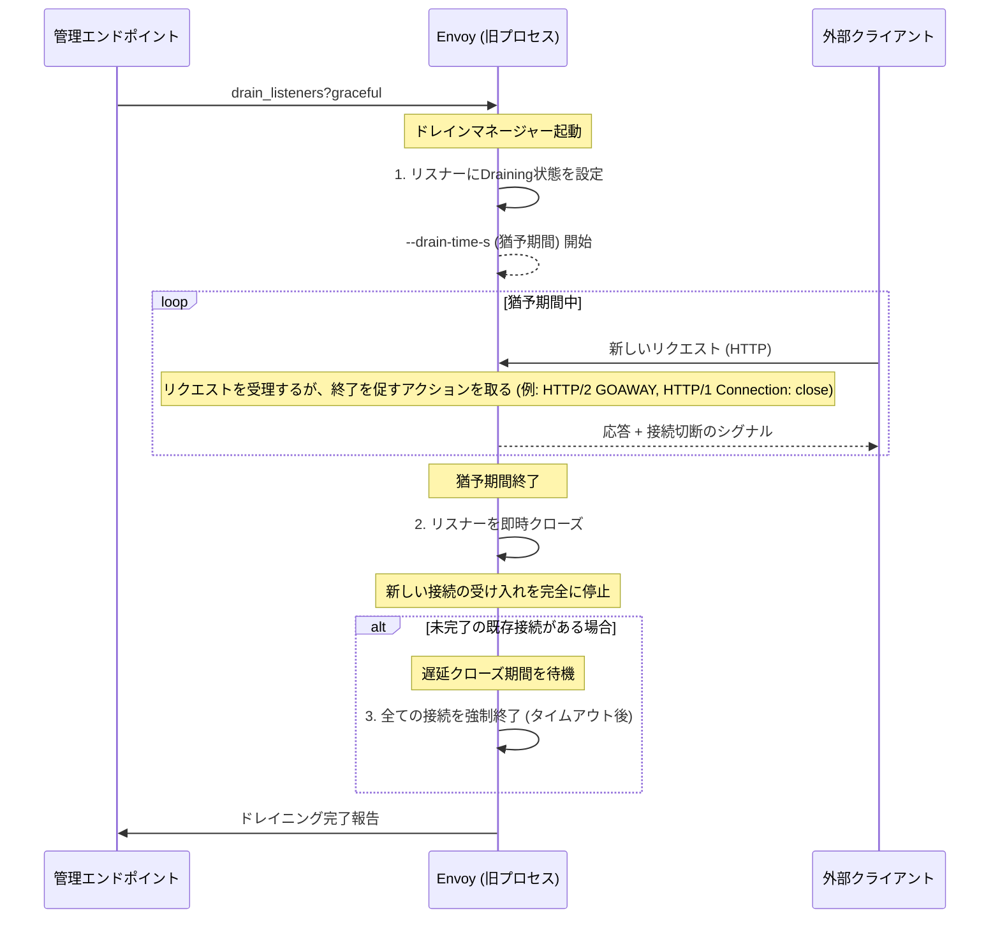

# Draining

- [Draining](#draining)
  - [Ref](#ref)
  - [Envoyのドレイニング（Draining）概要](#envoyのドレイニングdraining概要)
    - [1. ドレイニングが開始されるタイミング](#1-ドレイニングが開始されるタイミング)
    - [2. ドレイニングの動作タイプ](#2-ドレイニングの動作タイプ)
    - [3. ドレイニングのメカニズム（HTTP接続マネージャーの例）](#3-ドレイニングのメカニズムhttp接続マネージャーの例)
    - [4. リスナーごとのドレイニング制御 (`drain_type`)](#4-リスナーごとのドレイニング制御-drain_type)
  - [Envoyの優雅なドレイニングシーケンス図](#envoyの優雅なドレイニングシーケンス図)

## Ref

https://www.envoyproxy.io/docs/envoy/latest/intro/arch_overview/operations/draining

## Envoyのドレイニング（Draining）概要

**ドレイニング**とは、Envoyがサーバーシャットダウンや設定更新の際に、既存の接続を優雅に終了させ、新しい接続の受け入れを徐々に停止するプロセスです。これにより、トラフィックの中断（ダウンタイム）を最小限に抑えます。

### 1. ドレイニングが開始されるタイミング

ドレイニングは、サーバーオプションや個々のリスナー設定に基づいて、以下のシナリオで発生します。

* **ホットリスタート (Hot Restart)**: 新しいEnvoyプロセスが立ち上がるとき。
* **管理エンドポイントによるトリガー**:
  * `drain_listeners?graceful` 管理エンドポイントを通じて優雅なドレインシーケンスが開始されたとき。
  * `healthcheck/fail` 管理エンドポイントを通じて手動でヘルスチェックが失敗とされたとき。
* **LDSによるリスナーの変更・削除**: LDS (Listener Discovery Service) を通じて個別のリスナーが変更または削除されるとき。

### 2. ドレイニングの動作タイプ

ドレイニングの動作は、設定（特に`--drain-time-s`）と、リスナーのコンフィグ内の`drain_type`設定によって異なります。

| 動作 | 説明 | デフォルト設定 |
| :--- | :--- | :--- |
| **即時停止 (Immediate Stop)** | リスナーを直ちに閉じ、新しい接続の受け入れを即座に停止します。優雅なドレイニング動作はありません。 (`drain_listeners` パラメータなし) | サーバーシャットダウン時 |
| **優雅なドレイン (Graceful Drain)** | 設定されたドレインタイム (`--drain-time-s`) の間、新しいリクエストの受け入れを**抑止**しつつ、既存の接続の完了を待ちます。 | `drain_listeners?graceful` |

### 3. ドレイニングのメカニズム（HTTP接続マネージャーの例）

優雅なドレイニングをサポートしているのは、**HTTP接続マネージャー**や一部のプロキシフィルター（Redis, Mongo, Thriftなど）です。

  * **HTTP/1 リクエスト**: 応答に **`Connection: close`** ヘッダーを追加し、クライアントに接続切断を促します。
  * **HTTP/2 リクエスト**: **`GOAWAY`** フレームを送信し、これ以上新しいストリーム（リクエスト）を開始しないようにクライアントに通知します。
  * **接続の終了**: リクエスト完了後、**遅延クローズ期間**を経て接続が終了されます。

### 4. リスナーごとのドレイニング制御 (`drain_type`)

リスナー設定内の `drain_type` は、どのトリガーでドレイニングを行うかを制御します。

| `drain_type` | トリガー | 目的 |
| :--- | :--- | :--- |
| **default** | 全てのケース（ヘルスチェック失敗、ホットリスタート、LDS更新/削除） | 標準的な運用時の挙動。 |
| **modify\_only** | ホットリスタート、LDS更新/削除のみ | Ingress/Egress両方を持つEnvoyで、Egressリスナーのドレインを制御したい場合に有用（Ingressドレインに依存）。 |

## Envoyの優雅なドレイニングシーケンス図

以下は、管理エンドポイントによって優雅なドレイニングがトリガーされ、Envoyが接続を処理するフローを示すシーケンス図です。

