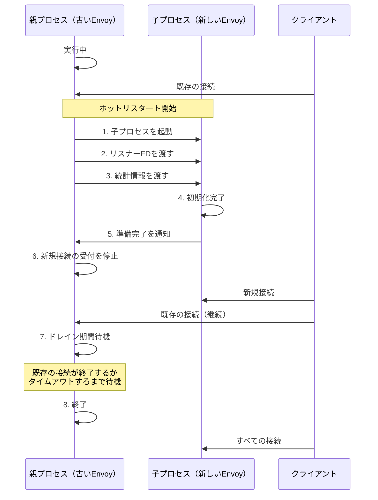

# Envoy ホットリスタート機能

- [Envoy ホットリスタート機能](#envoy-ホットリスタート機能)
  - [ホットリスタートとは](#ホットリスタートとは)
  - [仕組み](#仕組み)
    - [1. 共有メモリの使用](#1-共有メモリの使用)
    - [2. ソケットの受け渡し](#2-ソケットの受け渡し)
    - [3. ドレイン処理](#3-ドレイン処理)
  - [使用方法](#使用方法)
    - [コマンドライン](#コマンドライン)
    - [restarter.py スクリプト](#restarterpy-スクリプト)
  - [設定オプション](#設定オプション)
  - [制限事項](#制限事項)
  - [ベストプラクティス](#ベストプラクティス)
  - [トラブルシューティング](#トラブルシューティング)
    - [共通の問題](#共通の問題)
  - [まとめ](#まとめ)

Envoyの重要な機能の一つに、ゼロダウンタイムでの再起動を可能にする「ホットリスタート」機能があります。このドキュメントでは、ホットリスタート機能の仕組み、利点、および使用方法について説明します。

## ホットリスタートとは

ホットリスタートとは、サービスを中断することなく、Envoyプロセスを新しいバージョンに置き換える機能です。これにより、以下のような操作が可能になります：

- 設定の更新
- バイナリのアップグレード
- メモリリークの解消

通常のプロセス再起動では、既存の接続がすべて切断され、サービスが一時的に利用できなくなりますが、ホットリスタートを使用すると、既存の接続を維持したまま新しいプロセスに移行できます。

## 仕組み

Envoyのホットリスタートは、以下のステップで実行されます：



### 1. 共有メモリの使用

Envoyは共有メモリ領域を使用して、親プロセスと子プロセス間でデータを共有します。この共有メモリには以下の情報が含まれます：

- 統計情報
- ロック
- プロセス間通信用のキュー

### 2. ソケットの受け渡し

Unixドメインソケットを使用して、親プロセスから子プロセスにリスナーソケットのファイルディスクリプタを渡します。これにより、子プロセスは同じポートでリクエストを受け付けることができます。

### 3. ドレイン処理

親プロセスは新しい接続の受け付けを停止し、既存の接続が完了するまで待機します（ドレイン期間）。ドレイン期間はデフォルトで900秒（15分）ですが、設定で変更可能です。

## 使用方法

### コマンドライン

Envoyのホットリスタートは、`--hot-restart-version`フラグを使用して実行します：

```bash
# 最初のEnvoyプロセスを起動
envoy --config-path /etc/envoy/envoy.yaml --restart-epoch 0

# ホットリスタートを実行（新しい設定で）
envoy --config-path /etc/envoy/envoy-new.yaml --restart-epoch 1
```

`restart-epoch`は、リスタートの回数を示す整数値です。各ホットリスタートでこの値をインクリメントする必要があります。

### restarter.py スクリプト

Envoyには、ホットリスタートを簡単に実行するための`restarter.py`スクリプトが付属しています：

```bash
# 初回起動
./restarter.py start --config-path /etc/envoy/envoy.yaml

# ホットリスタート
./restarter.py restart --config-path /etc/envoy/envoy-new.yaml
```

このスクリプトは、適切な`restart-epoch`値を自動的に管理します。

## 設定オプション

ホットリスタートに関連する主な設定オプションは以下の通りです：

| オプション | 説明 | デフォルト値 |
|------------|------|-------------|
| `--restart-epoch` | リスタートの回数 | 必須 |
| `--drain-time-s` | ドレイン期間（秒） | 900 |
| `--parent-shutdown-time-s` | 親プロセスが強制終了するまでの時間（秒） | 60 |
| `--disable-hot-restart` | ホットリスタート機能を無効化 | false |

## 制限事項

ホットリスタート機能には以下の制限事項があります：

1. **バイナリの互換性**: 親プロセスと子プロセスのバイナリバージョンに互換性がない場合、ホットリスタートは失敗します。
2. **共有メモリサイズ**: 共有メモリのサイズは起動時に固定されるため、統計情報の数が大幅に増加する設定変更はホットリスタートに失敗する可能性があります。
3. **リスナー設定**: 一部のリスナー設定変更はホットリスタート中に適用できない場合があります。
4. **コンテナ環境**: 一部のコンテナ環境では、共有メモリやソケットの受け渡しに制限がある場合があります。

## ベストプラクティス

1. **定期的なテスト**: 本番環境と同様の設定でホットリスタートを定期的にテストし、問題がないことを確認します。
2. **監視**: ホットリスタート中のトラフィックパターンを監視し、問題が発生していないことを確認します。
3. **段階的なロールアウト**: 大規模な環境では、すべてのEnvoyインスタンスを一度にホットリスタートするのではなく、段階的にロールアウトします。
4. **ドレイン時間の調整**: ワークロードに応じてドレイン時間を適切に設定します。長時間接続を使用するアプリケーションでは、長めのドレイン時間が必要になる場合があります。

## トラブルシューティング

### 共通の問題

1. **バイナリの互換性エラー**:
   ```
   hot restart compatibility error: mismatched capability flags
   ```
   解決策: 同じバージョンのEnvoyを使用するか、`--disable-hot-restart`フラグを使用して通常の再起動を行います。

2. **共有メモリエラー**:
   ```
   unable to initialize shared memory region
   ```
   解決策: システムの共有メモリ設定を確認し、必要に応じて増やします。

3. **ソケットエラー**:
   ```
   unable to open socket for hot restart
   ```
   解決策: ファイルディスクリプタの制限を確認し、必要に応じて増やします。

## まとめ

Envoyのホットリスタート機能は、ゼロダウンタイムでの設定更新やバイナリアップグレードを可能にする強力な機能です。適切に使用することで、サービスの可用性を維持しながらEnvoyを更新できます。ただし、いくつかの制限事項があるため、本番環境で使用する前に十分にテストすることが重要です。
