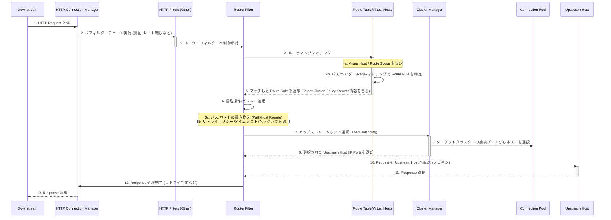

# HTTP ルーティングのシーケンス

- [HTTP ルーティングのシーケンス](#http-ルーティングのシーケンス)
  - [主要なルーティング機能の解説](#主要なルーティング機能の解説)
    - [1. ルーティングの意思決定 (Route Matching)](#1-ルーティングの意思決定-route-matching)
    - [2. リクエスト操作 (Rewriting \& Redirection)](#2-リクエスト操作-rewriting--redirection)
    - [3. 高度な転送ポリシー (Policies)](#3-高度な転送ポリシー-policies)
    - [4. Direct Responses](#4-direct-responses)

ダウンストリームクライアントからのHTTPリクエストがEnvoyに到達し、アップストリームサーバーへ転送されるまでの主要なステップを示します。

## 主要なルーティング機能の解説

### 1. ルーティングの意思決定 (Route Matching)

Envoyのルーティングは、**ルートテーブル**（`Route Table`）に基づいて行われます。

- **Virtual Hosts & Clusters**:
  - ドメイン名や `:authority` ヘッダーに基づいて、まず**Virtual Host** を決定します。
  - この Virtual Host 内に、具体的なルーティングルール（**Route Rule**）が定義されています。
- **マッチング基準**:
  - リクエストの **パス** (`/path` や `/prefix`)、**ヘッダー**、**クエリパラメータ**、**正規表現**など、多岐にわたる条件でルールを照合します。
- **Route Scope (SRDS)**:
  - 大規模な設定において、リクエストヘッダーなどの動的なキーに基づいて、検索対象のルートテーブルを絞り込む（スコープを制限する）高度な機能です。
  - これにより、マッチングの効率（**O(log N)** に近いサブ線形マッチング）が向上します。

### 2. リクエスト操作 (Rewriting & Redirection)

- **Path/Prefix Rewriting**:
  - アップストリームにリクエストを転送する直前に、リクエストのパスやプレフィックスを変更できます。
  - 例えば、外部からは `/v1/users` でも、内部サービスには `/users` として転送することが可能です。
- **Redirection**:
  - ルートにマッチしたリクエストを、指定された別のURLやTLS (`https`) へリダイレクトするよう、クライアントに指示できます。

### 3. 高度な転送ポリシー (Policies)

Envoyのルーターは、単にリクエストを転送するだけでなく、信頼性とパフォーマンスを高めるための高度なポリシーを適用します。

- **タイムアウト & リトライ (Retries)**:
  - **最大リトライ回数**や、ネットワーク障害、特定のステータスコード（例：`5xx`）などの**リトライ条件**を設定できます。
- **リトライ予算 (Retry Budgets)**:
  - リトライが元のトラフィックを過剰に増加させ、サービスに負荷をかける（**リトライストーム**）のを防ぐため、リトライの割合に上限を設定します。
- **リクエストヘッジング (Request Hedging)**:
  - **リクエストがタイムアウト**した場合、元のリクエストをキャンセルせずに、**追加で別のアップストリームホストにリトライリクエストを送信**し、最初に返ってきた「良い」レスポンスを採用する手法です。
  - これは遅延を最小限に抑えるのに役立ちます。
- **トラフィックシフティング/スプリッティング**:
  - 重み付け (`weight/percentage`) に基づいて、トラフィックを複数のアップストリームクラスターに分散させ、カナリアリリースや A/B テストなどを実現します。

### 4. Direct Responses

- ルーターフィルターは、アップストリームへのプロキシを行わず、Envoy自体が直接 HTTP レスポンス（ステータスコードやボディ）を返すように設定することも可能です。
  - これは、リダイレクトや簡単なエラー応答を効率的に処理するために使用されます。
