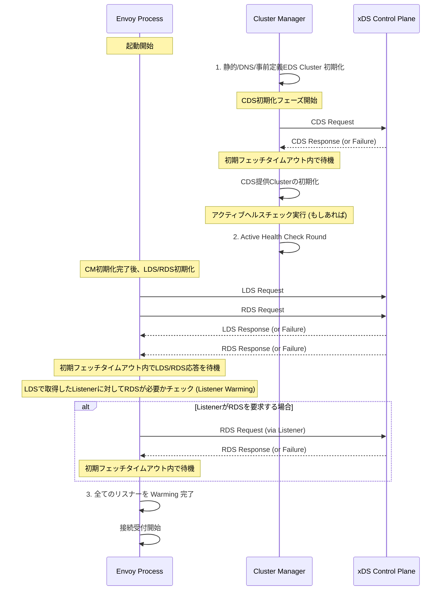

# Envoyの初期化プロセス

- [Envoyの初期化プロセス](#envoyの初期化プロセス)
  - [Ref](#ref)
  - [Envoyの初期化プロセス概要](#envoyの初期化プロセス概要)
    - [1. 起動時の初期化フロー（ハイレベル）](#1-起動時の初期化フローハイレベル)
    - [2. Envoyの初期化シーケンス図](#2-envoyの初期化シーケンス図)
    - [3. 設計原則：保証された初期化時間](#3-設計原則保証された初期化時間)

## Ref

https://www.envoyproxy.io/docs/envoy/latest/intro/arch_overview/operations/init

## Envoyの初期化プロセス概要

Envoyが起動してから実際に接続を受け入れ始めるまでの初期化手順は、複雑な多段階プロセスです。このプロセスは、**リスナーが新しい接続を受け入れる前**にすべて完了し、特に**ホットリスタート**時に新しいプロセスが完全に準備完了であることを保証します。

### 1. 起動時の初期化フロー（ハイレベル）

Envoyの初期化は、依存関係の深いリソースから順に行われます。各ステップでは、管理サーバーからの応答（または失敗）を、設定された**初期フェッチタイムアウト** (`initial_fetch_timeout`) 内で待ちます。

| ステップ | 担当コンポーネント | 処理内容 | 目的 |
| :--- | :--- | :--- | :--- |
| **フェーズ 1** | クラスターマネージャー | 静的/DNS/事前定義**EDS**クラスターの初期化。その後、**CDS** (Cluster Discovery Service) が利用可能な場合は初期化。 | アップストリームへの接続先を確保する。 |
| **ヘルスチェック** | クラスターマネージャー | **アクティブヘルスチェック**を有効にしている場合、最初のラウンドを実行。 | 接続可能エンドポイントのリストを検証する。 |
| **フェーズ 2** | RDS/LDS | **LDS** (Listener Discovery Service) と**RDS** (Route Discovery Service) の初期化。 | 接続を受け入れるためのポート設定とルーティング規則を準備する。 |
| **フェーズ 3** | LDS/RDS連携 | LDSで取得したリスナーがRDS応答を必要とする場合、RDS応答を待機 (リスナーウォーミング)。 | 受信接続に対する完全なルーティング情報を持つリスナーを準備する。 |
| **完了** | リスナー | リスナーが新しい接続の受け入れを開始。 | サービスをインフラストラクチャに提供開始。 |

### 2. Envoyの初期化シーケンス図

Envoyが外部の管理サーバー (`xDS Control Plane`) や内部のクラスターマネージャーとどのように連携し、リスナーが起動するまでの段階を追ったシーケンス図です。

### 3. 設計原則：保証された初期化時間

Envoyの初期化における重要な設計原則は、管理サーバーの可用性を考慮しつつ、Envoyが常に設定された`initial_fetch_timeout`時間内に初期化を完了することが保証されている点です。

このフローにより、Envoyは設定が不完全な状態や、アップストリーム情報がない状態で接続を受け入れることを防ぎ、特に**ホットリスタート**時には、新しいプロセスが完全にトラフィックを処理できる状態になってから古いプロセスの処理を停止できるようにします。
