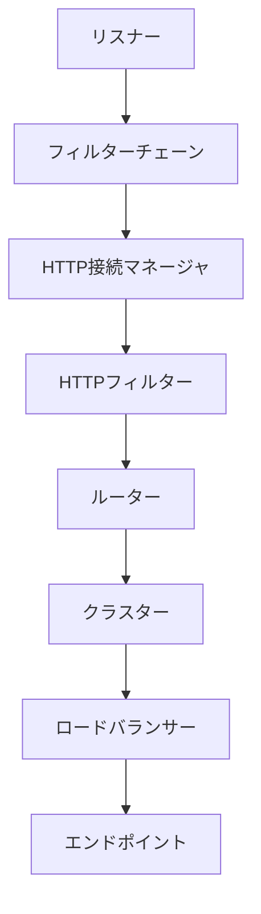
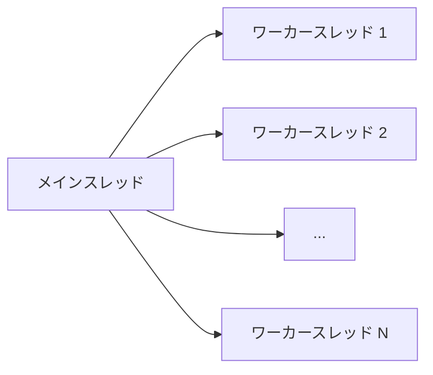

# Envoy アーキテクチャ概要

## Envoyとは

Envoyは、大規模な現代的サービス指向アーキテクチャのために設計された、L7プロキシおよび通信バスです。プロジェクトは以下の信念に基づいています：

> ネットワークは透過的であるべきである。問題が発生した場合、アプリケーションコードを変更するのではなく、ネットワークとその問題を簡単に理解できるようにすべきである。

実際には、この目標を達成することは非常に困難です。Envoyはこの問題に対して以下のアプローチを取ります：

## 設計目標

Envoyは以下の設計目標を持っています：

1. **プロセス外アーキテクチャ**: Envoyはアプリケーションとは別のプロセスとして実行されます。これにより、任意の言語やフレームワークで書かれたアプリケーションと連携できます。

2. **モダンなC++コードベース**: Envoyは高性能なC++14で書かれており、メモリ使用量が少なく、高速です。

3. **L3/L4フィルター**: Envoyは基本的にL3/L4（TCP/UDP）ネットワークプロキシとして機能します。様々なL4フィルターのチェーンをリスナーに接続でき、TCP/UDPトラフィックを処理できます。

4. **HTTP L7フィルター**: HTTPはモダンなWebアプリケーションの主要なプロトコルであるため、Envoyは強力なHTTP L7フィルターレイヤーを提供します。

5. **ファーストクラスHTTP/2サポート**: HTTP/1.1とHTTP/2の両方をサポートし、両プロトコル間の透過的なプロキシをサポートします。

6. **高度なロードバランシング**: 自動再試行、サーキットブレーキング、グローバルレート制限、シャドウリクエスト、ゾーンローカルロードバランシングなどの高度な機能をサポートします。

## コアコンポーネント

Envoyのアーキテクチャは以下の主要コンポーネントで構成されています：

### リスナー

リスナーはEnvoyがトラフィックを受信するネットワークの場所（IPアドレスとポート）です。Envoyは複数のリスナーを持つことができ、それぞれが異なるプロトコルやフィルターチェーンを持つことができます。

### フィルターチェーン

各リスナーは一連のフィルターを持ち、これらのフィルターがリクエストを処理します。フィルターには以下の種類があります：

- **リスナーフィルター**: 新しい接続が確立されたときに実行されます
- **ネットワークフィルター**: L4（TCP/UDP）レベルで動作します
- **HTTPフィルター**: L7（HTTP）レベルで動作します

### HTTP接続マネージャ

HTTP接続マネージャーは特殊なネットワークフィルターで、HTTP/1.1、HTTP/2、HTTP/3プロトコルを処理し、HTTPフィルターチェーンを管理します。

### HTTPフィルター

HTTPフィルターはHTTPリクエストとレスポンスを処理します。一般的なフィルターには以下があります：

- ルーター: バックエンドサービスへのリクエストのルーティング
- RBAC: ロールベースのアクセス制御
- Lua: Luaスクリプトの実行
- gRPC-JSON: gRPCとJSONの間の変換
- レート制限: リクエストのレート制限

### クラスター

クラスターはEnvoyが接続するバックエンドサービスのグループです。各クラスターには以下の設定があります：

- サービスディスカバリ方法（静的、DNS、EDS）
- ロードバランシングポリシー
- ヘルスチェック設定
- サーキットブレーカー設定

### ロードバランサー

ロードバランサーはクラスター内のエンドポイント間でトラフィックを分散させる方法を決定します。サポートされているアルゴリズムには以下があります：

- ラウンドロビン
- 最小接続数
- リングハッシュ（一貫性のあるハッシュ）
- ランダム
- マルチプライオリティ

### エンドポイント

エンドポイントは実際のバックエンドサービスのインスタンスです。IPアドレスとポートで識別されます。

## スレッディングモデル

Envoyは以下のスレッドモデルを採用しています：

- **シングルプロセス、マルチスレッドアーキテクチャ**: 1つのEnvoyプロセスが複数のスレッドを実行します
- **スレッドローカルストレージ**: 各ワーカースレッドは独自の接続プールとイベントループを持ちます
- **ノンブロッキングI/O**: すべてのI/Oはノンブロッキングです
- **接続所有権**: 接続は単一のワーカースレッドによって所有され、そのスレッドでのみ処理されます

## 動的設定

Envoyは動的設定をサポートしており、実行中に設定を更新できます。これは以下のAPIを通じて行われます：

- **リスナーディスカバリーサービス (LDS)**: リスナーの動的設定
- **ルートディスカバリーサービス (RDS)**: HTTPルートの動的設定
- **クラスターディスカバリーサービス (CDS)**: クラスターの動的設定
- **エンドポイントディスカバリーサービス (EDS)**: エンドポイントの動的設定
- **シークレットディスカバリーサービス (SDS)**: TLS証明書の動的設定

## 可観測性

Envoyは以下の可観測性機能を提供します：

- **統計情報**: 広範な統計情報を生成し、様々なシンクに送信できます（statsd、Prometheus等）
- **分散トレーシング**: Zipkin、Jaeger、Datadog、OpenCensusなどのトレーシングシステムと統合
- **アクセスログ**: カスタマイズ可能なアクセスログ形式
- **管理インターフェース**: 実行時の統計情報、設定、ログレベルの変更などを提供

## ホットリスタート

Envoyはゼロダウンタイムでの再起動をサポートしています。新しいプロセスが起動すると、古いプロセスから以下の情報を引き継ぎます：

- リスナーソケット
- 既存の接続
- 統計情報

これにより、設定の更新やバイナリのアップグレードをダウンタイムなしで行うことができます。
