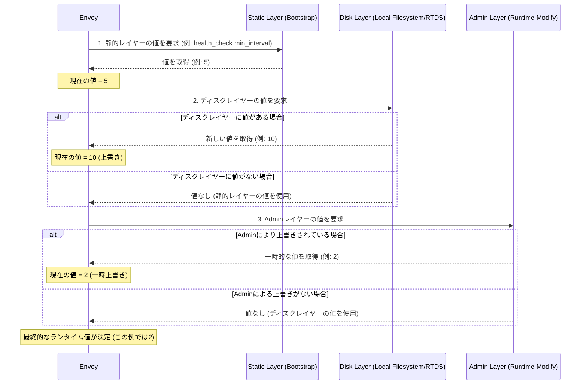

# Runtime Configuration or Feature Flag

- [Runtime Configuration or Feature Flag](#runtime-configuration-or-feature-flag)
  - [Envoy ランタイム設定 (Runtime Configuration)](#envoy-ランタイム設定-runtime-configuration)
    - [1. ランタイム設定の階層構造（Layering）](#1-ランタイム設定の階層構造layering)
      - [典型的なレイヤー構造の例](#典型的なレイヤー構造の例)
    - [2. ランタイム値の解決シーケンス](#2-ランタイム値の解決シーケンス)
    - [3. 動的更新メカニズム](#3-動的更新メカニズム)
    - [4. その他の重要な側面](#4-その他の重要な側面)

## Envoy ランタイム設定 (Runtime Configuration)

**ランタイム設定**は、Envoyサーバーを**再起動せずに**様々な設定や挙動を変更できるようにするメカニズムです。これは、機能の有効/無効を切り替えたり（**ランタイムガード**）、リスクのある変更を一時的に無効化したりするための安全策としても活用されます。

### 1. ランタイム設定の階層構造（Layering）

ランタイム設定は、複数のレイヤーからなる**仮想ファイルシステム**として機能します。設定値は、後のレイヤーに定義されている値が前のレイヤーの値を上書き（オーバーライド）するという原則で適用されます。

#### 典型的なレイヤー構造の例

| レイヤー名 | ソース | 役割 | 優先度 (後ほど適用されるほど高い) |
| :--- | :--- | :--- | :--- |
| `static_layer_0` | **静的ブートストラップ** | 最も基本的なデフォルト値。 | 低 |
| `disk_layer_0` | **ローカルディスク** (`/srv/runtime/current/envoy`など) | グローバルな動的設定。 | 中 |
| `disk_layer_1` | **ローカルディスク（オーバーライド）** | 特定のサービス・クラスター向けのカスタム設定。 | 高 |
| `admin_layer_0` | **Admin Console** | `/runtime_modify` エンドポイントによる実行時の一時的な上書き。 | 最高 |

### 2. ランタイム値の解決シーケンス

Envoyが特定のランタイムキー（例：`health_check.min_interval`）の値を取得する際、その値は定義されたレイヤーを順にチェックすることで決定されます。

### 3. 動的更新メカニズム

ランタイム設定の最大の利点は、**実行中に値を更新できる**点です。

* **ローカルディスク更新**:
    1. 新しいランタイムツリー全体を作成し、変更を書き込みます。
    2. `ln -s /srv/runtime/v2 new && mv -Tf new current` のようなコマンドで、シンボリックリンク（`current`）を**アトミックに**新しいツリーに切り替えます。
    3. Envoyはファイル移動操作（シンボリックリンクの変更）を検知し、新しいスナップショットを生成します。
* **RTDS (Runtime Discovery Service)**:
  * 通常のxDSプロトコルを通じて、管理サーバーから動的にランタイム層の設定（`Runtime message`）を受け取ります。
* **Admin Console**:
  * `/runtime_modify` エンドポイントを通じて、メモリ上のAdminレイヤーの値を即座に変更します（セキュリティに注意が必要です）。

### 4. その他の重要な側面

* **ファイルシステムレイアウト**: ランタイムキーのピリオド（`.`）は、ファイルシステム階層の新しいディレクトリに対応します（例：`health_check.min_interval` は `health_check/min_interval`）。
* **統計情報**: ランタイムプロバイダーは、`runtime.` ネームスペースで統計情報（例：`load_success`, `load_error`, `num_keys`）を出力します。
* **非推奨機能への対応**: ランタイムキーは、非推奨機能のライフサイクル管理（警告、デフォルトで拒否、コード削除）にも利用されます。例えば、`envoy.deprecated_features:full_fieldname` を `true` に設定することで、デフォルトで拒否される非推奨機能を一時的に使用可能にできます。
