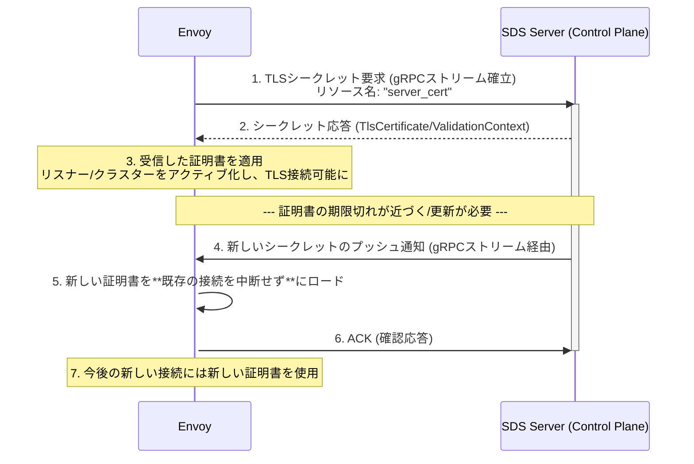

# Secret Discovery Service (SDS)

- [Secret Discovery Service (SDS)](#secret-discovery-service-sds)
  - [SDSによるシークレット動的更新のシーケンス](#sdsによるシークレット動的更新のシーケンス)
  - [SDSの仕組みと利点](#sdsの仕組みと利点)
    - [1. SDSの重要性：動的証明書管理](#1-sdsの重要性動的証明書管理)
    - [2. SDSサーバーとの接続の確立](#2-sdsサーバーとの接続の確立)
    - [3. リスナーとクラスターのアクティブ化](#3-リスナーとクラスターのアクティブ化)
    - [4. キーローテーションの代替手段](#4-キーローテーションの代替手段)

## SDSによるシークレット動的更新のシーケンス

Envoyが起動後、SDSサーバーに接続し、TLS証明書を取得・更新する基本的な流れをシーケンス図で示します。

## SDSの仕組みと利点

### 1. SDSの重要性：動的証明書管理

SDSが解決する最大の課題は、従来の**静的設定**における証明書管理の困難さです。

| 方式 | シークレットの場所 | 更新が必要な場合 | サービスの継続性 |
| :--- | :--- | :--- | :--- |
| **静的設定** | Bootstrapファイル内に直接、またはファイルパスとして記述。 | 証明書ファイルを更新後、**Envoyプロセスの再起動（再デプロイ）が必要**。 | 一時的なダウンタイムが発生する可能性がある。 |
| **SDS** | 集中管理された **SDSサーバー** から gRPC 経由で取得。 | SDSサーバーが新しい証明書を**プッシュ**。Envoyは**即座に適用**。 | **再起動不要**。サービスの継続性が保たれる。 |

### 2. SDSサーバーとの接続の確立

EnvoyとSDSサーバー間の通信は、機密情報を扱うため**必ずセキュア**でなければなりません。

* **同一ホストの場合**: **Unix Domain Socket (UDS)** を使用することでセキュアな接続を確保できます。
* **リモートの場合**: **TLS接続**が必要です。認証には、クライアント証明書を静的に設定する **mTLS** や **AWS IAM SigV4** などが使われます。SDSサーバーは、他のxDSサービスと同様に、`SecretDiscoveryService` gRPCサービスを実装する必要があります。

### 3. リスナーとクラスターのアクティブ化

Envoyは、依存するシークレットがSDSから取得されるまで、関連するリソースをアクティブにしません。

* **リスナー (Listener)**: サーバー証明書が取得されるまでポートは開きません。取得に失敗した場合、ポートは開かれますが、接続はすぐに**リセット**されます。
* **クラスター (Cluster)**: クライアント証明書（アップストリームへのmTLS用）が取得されるまで使用されません。取得に失敗した場合、クラスターはアクティブになりますが、リクエストは**拒否**されます。

### 4. キーローテーションの代替手段

gRPC SDSが最も推奨されるローテーション方法ですが、Envoyは証明書がファイルパスを参照している場合、**ファイルシステムの変更**に基づいてシークレットを自動的にリロードする機能もサポートしています。

* `TlsCertificate` や `CertificateValidationContext` の設定で**ファイルパス**を指定すると、Envoyはデフォルトでそのファイルを含む**ディレクトリの変更**を監視し、ファイルが更新されると自動で新しいシークレットをロードします。
* これにより、アトミックなファイル置換操作（例：シンボリックリンクを新しいファイルにアトミックに置き換える操作）を利用して、安全にローテーションを行うことができます。

SDSは、現代のマイクロサービス環境における**セキュリティと運用効率**を両立させるために不可欠な機能です。
