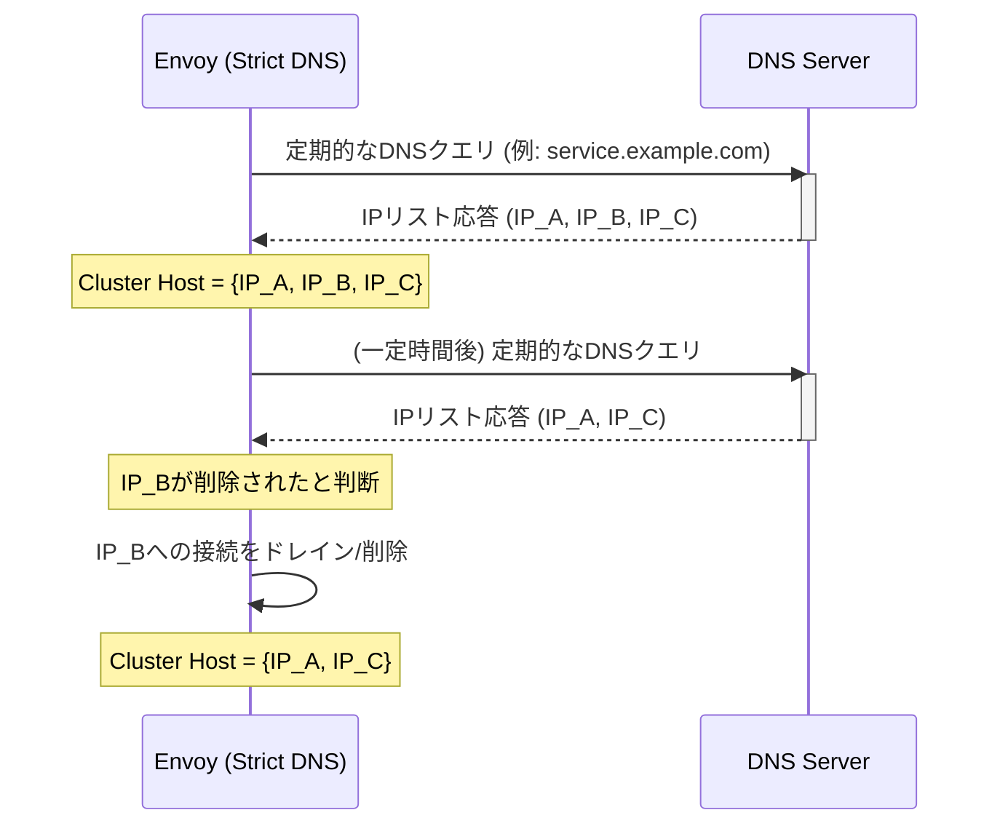

# Service Discovery

- [Service Discovery](#service-discovery)
  - [Envoyのサービスディスカバリ (Service Discovery)](#envoyのサービスディスカバリ-service-discovery)
  - [1. サポートされるサービスディスカバリタイプ](#1-サポートされるサービスディスカバリタイプ)
    - [A. Static (静的)](#a-static-静的)
    - [B. DNSベースのディスカバリ](#b-dnsベースのディスカバリ)
      - [1. Strict DNS (厳密DNS)](#1-strict-dns-厳密dns)
      - [2. Logical DNS (論理DNS)](#2-logical-dns-論理dns)
    - [C. Discovery Service (ディスカバリサービス) ベース](#c-discovery-service-ディスカバリサービス-ベース)
      - [1. Endpoint Discovery Service (EDS)](#1-endpoint-discovery-service-eds)
      - [2. Custom Cluster (カスタムクラスター)](#2-custom-cluster-カスタムクラスター)
    - [D. Original Destination (オリジナルディスティネーション)](#d-original-destination-オリジナルディスティネーション)
  - [2. 結果整合性とアクティブヘルスチェック](#2-結果整合性とアクティブヘルスチェック)

## Envoyのサービスディスカバリ (Service Discovery)

**サービスディスカバリ**とは、Envoyが**アップストリームクラスター**（トラフィックを転送する先のバックエンド群）のメンバー（ホスト/エンドポイント）をどのように解決し、負荷分散リストに追加するかを決定するプロセスです。

Envoyは、フォワーディングパスでDNS同期解決を行わず、**非同期**かつ**結果整合性 (Eventually Consistent)** の考え方に基づいて動作します。

## 1. サポートされるサービスディスカバリタイプ

Envoyは、以下のような様々なサービスディスカバリタイプをサポートしています。

### A. Static (静的)

最も単純なタイプで、**設定ファイル内**に各アップストリームホストの具体的なIPアドレスやポート（またはUnixドメインソケット）を明示的に指定します。

### B. DNSベースのディスカバリ

#### 1. Strict DNS (厳密DNS)

Envoyは指定されたDNS名を**非同期**で継続的に解決します。

  * **特徴**: DNS応答で返された**全てのIPアドレス**をクラスターのホストとして扱います。
  * **整合性**: ホストがDNS結果から削除されると、Envoyはそれを**存在しない**とみなし、既存のコネクションプールからの**トラフィックをドレイン**します。
  * **非同期性**: 転送パスでDNS解決を待たないため、遅延が発生しません（結果整合性）。

<!-- end list -->

#### 2. Logical DNS (論理DNS)

主に**大規模Webサービス**（ラウンドロビンDNSを使用）向けに最適化されています。

* **特徴**: 新しい接続が必要なときに、DNS応答で返された**最初のIPアドレスのみ**を使用します。
* **整合性**: DNS結果の変化によって既存の接続をドレインしたり削除したりすることは**ありません**。これにより、接続サイクリングを防ぎ、**長寿命の接続**を維持します。

### C. Discovery Service (ディスカバリサービス) ベース

#### 1. Endpoint Discovery Service (EDS)

Envoyが推奨する動的ディスカバリメカニズムです。

* **特徴**: **xDS管理サーバー**（gRPCまたはREST/JSON API）からクラスターメンバー（**エンドポイント**）を取得します。
* **優位性**: 負荷分散重み、カナリーステータス、ゾーンなどの**詳細な属性**をホストごとに受け取ることができ、Envoyがよりインテリジェントな負荷分散決定を行えます。

#### 2. Custom Cluster (カスタムクラスター)

独自のディスカバリロジックを実装するために使用されます。

### D. Original Destination (オリジナルディスティネーション)

`iptables`の`REDIRECT`や`TPROXY`、またはProxy ProtocolなどによりEnvoyにリダイレクトされたインバウンド接続の**元の宛先アドレス**をアップストリームホストとして使用します。

## 2. 結果整合性とアクティブヘルスチェック

Envoyは、サービスディスカバリに**完全な一貫性は不要**であるという前提で設計されています。代わりに、**結果整合性**を持つディスカバリデータと**アクティブヘルスチェック**を組み合わせて、ホストの状態を決定します。

この組み合わせにより、**ディスカバリサービスがダウンしても**既存の健全なホストへのトラフィックは継続されます。

| ディスカバリ状態 | ヘルスチェック結果 | Envoyのルーティング動作 |
| :--- | :--- | :--- |
| **Discovered** (発見された) | **OK** | **ルーティングする** (正常) |
| **Absent** (非存在) | **OK** | **ルーティングする** (ディスカバリが故障しても健全なら継続) |
| **Discovered** (発見された) | **FAIL** | **ルーティングしない** (ヘルスチェックデータが優先) |
| **Absent** (非存在) | **FAIL** | **ルーティングしない** + **ホストを削除** (この状態でのみホストをパージ) |

**結論**: ヘルスチェックデータはディスカバリデータよりも正確であると見なされ、**ヘルスチェックに合格しているホスト**は、ディスカバリサービスから消えてもトラフィックを受け付け続けます。これにより、ディスカバリサービスの障害耐性が向上します。
