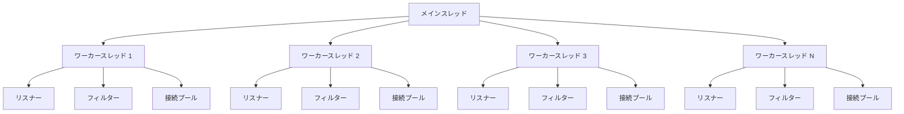

# Envoy スレッディングモデル

- [Envoy スレッディングモデル](#envoy-スレッディングモデル)
  - [基本アーキテクチャ](#基本アーキテクチャ)
  - [スレッドの種類](#スレッドの種類)
    - [1. メインスレッド](#1-メインスレッド)
    - [2. ワーカースレッド](#2-ワーカースレッド)
  - [スレッド間の通信](#スレッド間の通信)
  - [接続処理モデル](#接続処理モデル)
    - [接続の確立](#接続の確立)
    - [リクエスト処理](#リクエスト処理)
  - [スレッドローカルストレージ](#スレッドローカルストレージ)
  - [パフォーマンスの最適化](#パフォーマンスの最適化)
  - [設定オプション](#設定オプション)
  - [スレッディングモデルの利点](#スレッディングモデルの利点)
  - [制限事項](#制限事項)
  - [まとめ](#まとめ)

Envoyは高性能なプロキシを実現するために、効率的なスレッディングモデルを採用しています。このドキュメントでは、Envoyのスレッディングモデルの詳細と、その設計上の利点について説明します。

## 基本アーキテクチャ

Envoyは基本的に「シングルプロセス、マルチスレッド」アーキテクチャを採用しています。



## スレッドの種類

Envoyは以下の種類のスレッドを使用します：

### 1. メインスレッド

メインスレッドは以下の責務を持ちます：

- プロセスの初期化と終了
- xDS API（動的設定）の処理
- 管理サーバーの実行
- 統計情報のフラッシュ
- その他の管理タスク

メインスレッドはデータプレーン処理には関与せず、コントロールプレーンの処理に専念します。

### 2. ワーカースレッド

ワーカースレッドは実際のプロキシ処理を行います。各ワーカースレッドは以下の特徴を持ちます：

- 独立したイベントループを実行
- リスナーソケットを共有（SO_REUSEPORT使用）
- スレッド間で状態を共有しない（スレッドローカルストレージを使用）
- 接続の所有権を持つ（接続は常に同じスレッドで処理される）

デフォルトでは、ワーカースレッドの数はホストマシンの物理CPUコア数と同じになります。

## スレッド間の通信

Envoyのスレッド間通信は最小限に抑えられています：

- ワーカースレッド間の直接通信はほとんどない
- メインスレッドからワーカースレッドへの通信は、主に設定更新時に発生
- 通信はポスト型メッセージングを使用（スレッドをブロックしない）

## 接続処理モデル

Envoyの接続処理モデルは以下の特徴を持ちます：

### 接続の確立

1. クライアントがEnvoyに接続
2. カーネルがSO_REUSEPORTを使用して、接続をいずれかのワーカースレッドに割り当て
3. 割り当てられたワーカースレッドがその接続の所有権を持つ

### リクエスト処理

```ascii
+----------------+      +----------------+      +----------------+
|                |      |                |      |                |
| クライアント    +----->+ ワーカースレッド +----->+ アップストリーム |
|                |      |                |      |                |
+----------------+      +----------------+      +----------------+
```

1. ワーカースレッドがリクエストを受信
2. 同じワーカースレッドがフィルターチェーンを通じてリクエストを処理
3. 同じワーカースレッドがアップストリームサーバーへの接続を管理
4. 同じワーカースレッドがレスポンスを処理してクライアントに返す

## スレッドローカルストレージ

Envoyはスレッド間の競合を避けるために、スレッドローカルストレージを広範に使用します：

- 各ワーカースレッドは独自の接続プールを持つ
- 各ワーカースレッドは独自の統計カウンターを持つ
- 定期的にメインスレッドが各ワーカースレッドから統計情報を収集

## パフォーマンスの最適化

Envoyのスレッディングモデルは以下のパフォーマンス最適化を実現しています：

1. **ロックの最小化**: スレッド間の状態共有を最小限に抑えることで、ロックによる競合を減らします
2. **CPUアフィニティ**: ワーカースレッドを特定のCPUコアにバインドすることで、キャッシュの効率を向上させます
3. **ワークバランシング**: SO_REUSEPORTを使用して、カーネルレベルで接続を均等に分散させます
4. **メモリ局所性**: 接続が常に同じスレッドで処理されるため、キャッシュヒット率が向上します

## 設定オプション

Envoyのスレッディングモデルは以下の設定オプションで調整できます：

- `--concurrency`: ワーカースレッドの数を指定（デフォルトはCPUコア数）
- `--disable-hot-restart`: ホットリスタート機能を無効化
- `--enable-mutex-tracing`: ミューテックスのトレースを有効化（デバッグ用）

## スレッディングモデルの利点

Envoyのスレッディングモデルには以下の利点があります：

1. **スケーラビリティ**: CPUコア数に応じて線形にスケールします
2. **予測可能なパフォーマンス**: スレッド間の競合が少ないため、レイテンシの変動が小さくなります
3. **効率的なリソース使用**: 各スレッドが独立して動作するため、CPUとメモリの使用効率が向上します
4. **デバッグのしやすさ**: 各接続が単一のスレッドで処理されるため、問題の切り分けが容易になります

## 制限事項

Envoyのスレッディングモデルには以下の制限事項があります：

1. **スレッド間負荷分散**: 長時間の接続がある場合、ワーカースレッド間で負荷が不均衡になる可能性があります
2. **メモリオーバーヘッド**: 各ワーカースレッドが独自の接続プールを持つため、メモリ使用量が増加する可能性があります
3. **コア数の制限**: 非常に多数のCPUコアを持つシステムでは、すべてのコアを使用することが必ずしも最適ではない場合があります

## まとめ

Envoyのスレッディングモデルは、高性能なプロキシを実現するために慎重に設計されています。シングルプロセス、マルチスレッドアーキテクチャと接続の所有権モデルにより、スケーラブルで予測可能なパフォーマンスを提供します。スレッド間の状態共有を最小限に抑えることで、ロックによる競合を減らし、効率的なリソース使用を実現しています。
