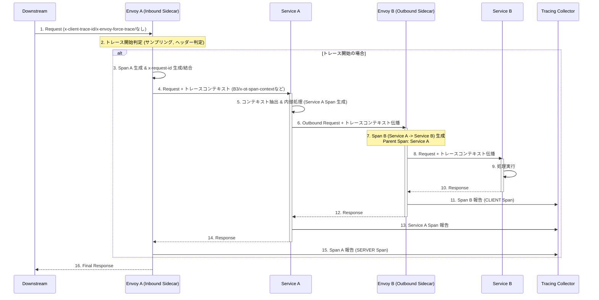

# 分散トレーシング(Distributed Tracing)

- [分散トレーシング(Distributed Tracing)](#分散トレーシングdistributed-tracing)
  - [Envoy トレーシングの構成要素](#envoy-トレーシングの構成要素)
    - [1. トレースの開始方法 (How to initiate a trace)](#1-トレースの開始方法-how-to-initiate-a-trace)
    - [2. IDとコンテキストの伝播 (Context Propagation)](#2-idとコンテキストの伝播-context-propagation)
    - [3. トレーススパンの種類 (Span Types and Modes)](#3-トレーススパンの種類-span-types-and-modes)
    - [4. 報告されるデータ](#4-報告されるデータ)

Envoyを経由するリクエストが、どのようにトレースコンテキストを取得し、次のサービスへ伝播させ、最終的にトレーシングコレクターに報告されるかを示します。

-----

## Envoy トレーシングの構成要素

### 1. トレースの開始方法 (How to initiate a trace)

Envoyは、以下のいずれかの条件が満たされたときにトレーシングを開始します。

- **外部クライアントによる開始**:
  - ダウンストリームリクエストに `x-client-trace-id` ヘッダーが含まれている場合、そのIDを信頼できる内部ID (`x-request-id`) に結合してトレースを開始します。
- **強制トレース**:
  - サービスが `x-envoy-force-trace` ヘッダーを付けてリクエストを送信した場合、強制的にトレースが開始されます。
- **ランダムサンプリング**:
  - 設定されたサンプリングレートに基づいて、ランダムにトレースが開始されます。

### 2. IDとコンテキストの伝播 (Context Propagation)

複数のサービスにまたがる処理を関連付け、一連の**トレース**として可視化するためには、**トレースコンテキスト**の伝播が不可欠です。

- **リクエストID (`x-request-id`)**:
  - Envoyが生成する一意のIDで、すべてのサービスにわたる**ログの関連付け**に必須です。
- **トレースコンテキストヘッダー**:
  - **スパン**（作業の論理単位）の親子関係を確立するために、トレーシングシステム固有のヘッダーが使用されます。
  - **Zipkin**: `x-b3-traceid`, `x-b3-spanid` (B3形式)
  - **OpenTelemetry/LightStep**: `traceparent`, `tracestate` など
  - **Datadog**: `x-datadog-trace-id` など

サービス（アプリケーション）は、**インバウンドリクエスト**からこれらのヘッダーを**抽出**し、次のサービスへの**アウトバウンドリクエスト**に**挿入**する役割を担います。

### 3. トレーススパンの種類 (Span Types and Modes)

トレースは、複数のスパンで構成されます。Envoyは、その配置モードによって生成するスパンの種類を区別します。

| モード | Envoyの配置 | スパン生成の役割 | トレースチェーンの例 |
| :--- | :--- | :--- | :--- |
| **サイドカーモード (結合)** | アプリケーションとEnvoyを**1つのホップ**として扱う。 | **インバウンドEnvoy**: `SERVER` Span を生成。 **アウトバウンドEnvoy**: `CLIENT` Span を生成。 | `-> [[SERVER (Envoy) -> App -> CLIENT (Envoy)]] -> ...` |
| **ゲートウェイ/独立モード** | Envoyを**独立したホップ**として扱う。 | **Envoy**: ダウンストリームからの受信で `SERVER` Span、アップストリームへの送信で `CLIENT` Span を生成。 | `-> [SERVER -> CLIENT] (Envoy) -> [SERVER] (App) -> ...` |

特に、サイドカーモードでEnvoyを独立したホップとして扱いたい場合は、設定で `spawn_upstream_span` を `true` に設定する必要があります。

### 4. 報告されるデータ

Envoyが生成するスパンには、以下の重要なメタデータが含まれます。

- リクエストの開始時刻と期間
- Envoyのオリジンクラスター名 (`--service-cluster`) やホスト名
- HTTP URL、メソッド、ステータスコード
- gRPCのステータスコードとメッセージ
- アップストリームクラスター名とアドレス

これらのデータは、設定された外部トレーシングコレクター（Zipkin、Jaeger、Datadogなど）へ自動的に送信され、完全なコールフローが可視化されます。
