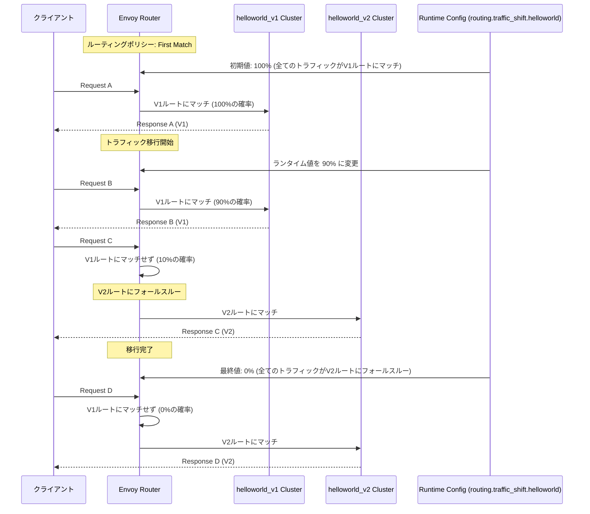
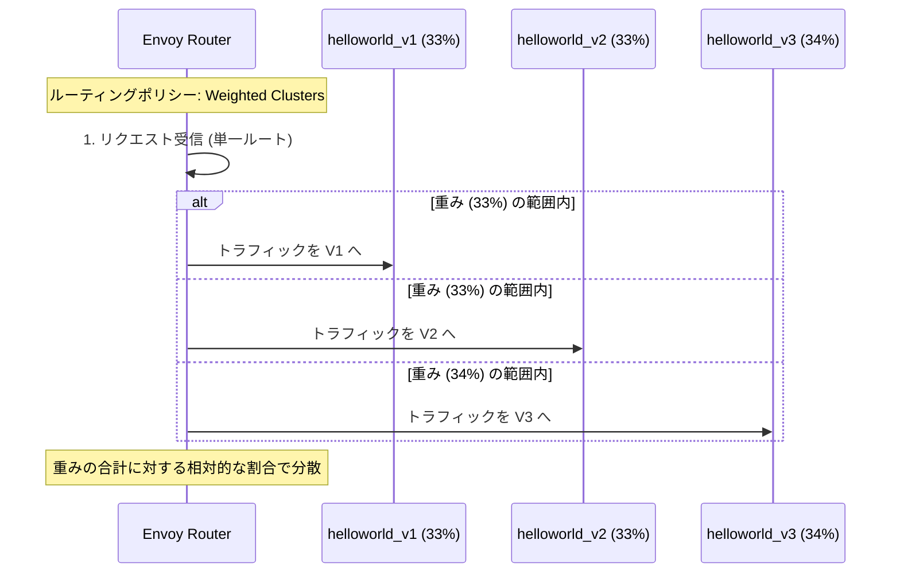

# Traffic Shifting nad Traffic Splitting

- [Traffic Shifting nad Traffic Splitting](#traffic-shifting-nad-traffic-splitting)
  - [Envoy トラフィック制御：シフティングとスプリッティング](#envoy-トラフィック制御シフティングとスプリッティング)
    - [1. トラフィック制御の主なユースケース](#1-トラフィック制御の主なユースケース)
  - [2. トラフィック・シフティングのメカニズム (Version Upgrades)](#2-トラフィックシフティングのメカニズム-version-upgrades)
    - [動作原理](#動作原理)
    - [シーケンス図：V1からV2への移行](#シーケンス図v1からv2への移行)
  - [3. トラフィック・スプリッティングのメカニズム (A/B Testing)](#3-トラフィックスプリッティングのメカニズム-ab-testing)
    - [動作原理](#動作原理-1)
    - [シーケンス図：重みによる均等分割](#シーケンス図重みによる均等分割)

## Envoy トラフィック制御：シフティングとスプリッティング

Envoyのルーターは、特定のルート（Virtual Host内のパス）に来るトラフィックを、**2つ以上のアップストリームクラスター**に分割（Split）または徐々に移行（Shift）させることができます。これは、サービスのデプロイメント戦略において非常に重要な機能です。

### 1. トラフィック制御の主なユースケース

| 用途 | 目的 | 実現方法 |
| :--- | :--- | :--- |
| **バージョンアップグレード (Shifting)** | 旧バージョンから新バージョンへ、トラフィックを**徐々に**移行させる（カナリーリリースなど）。 | **複数ルート**と**ランタイム・フラクション**を組み合わせる。 |
| **A/B/多変量テスト (Splitting)** | 複数の異なるバージョンのサービス間で、トラフィックを**静的または動的な割合**で分割し、同時にテストする。 | **単一ルート**と**重み付きクラスター (`weighted_clusters`)** を使用する。 |

## 2. トラフィック・シフティングのメカニズム (Version Upgrades)

トラフィック・シフティングは、Envoyの **「最初のルートがマッチする」** というルーティングポリシーと**ランタイム設定** を組み合わせることで実現されます。

### 動作原理

1. **V1ルート**をV2ルートより**先**に定義します。
2. **V1ルート**にのみ、リクエストをマッチさせる確率を示す**ランタイム・フラクション (`runtime_fraction`)** を設定します。
3. V1ルートにマッチしなかったリクエストは、後続の**V2ルート**に**フォールスルー（fall through）** します。
4. ランタイム設定の値を動的に変更することで、V1ルートへのトラフィック割合を徐々に減らし、V2ルートへのトラフィックを増やします。

### シーケンス図：V1からV2への移行

ここでは、**ランタイムキー**の値を操作することで、トラフィックがV1からV2へ移行する様子を示します。

## 3. トラフィック・スプリッティングのメカニズム (A/B Testing)

トラフィック・スプリッティングは、**単一のルート定義**内で、複数のクラスターに重みを割り当てることで実現されます。

### 動作原理

1. **`weighted_clusters`** オプションを使用して、複数のクラスター（例：V1, V2, V3）を単一のルートアクションに含めます。
2. 各クラスターには**重み (`weight`)** を指定します（例：33, 33, 34）。
3. Envoyは、全クラスターの重みの合計に対する相対的な割合に基づいて、トラフィックを分散します。
4. 各クラスターの重みは、**ランタイムキー** (`runtime_key_prefix` + `クラスター名`) を通じて動的に変更できます。

### シーケンス図：重みによる均等分割

