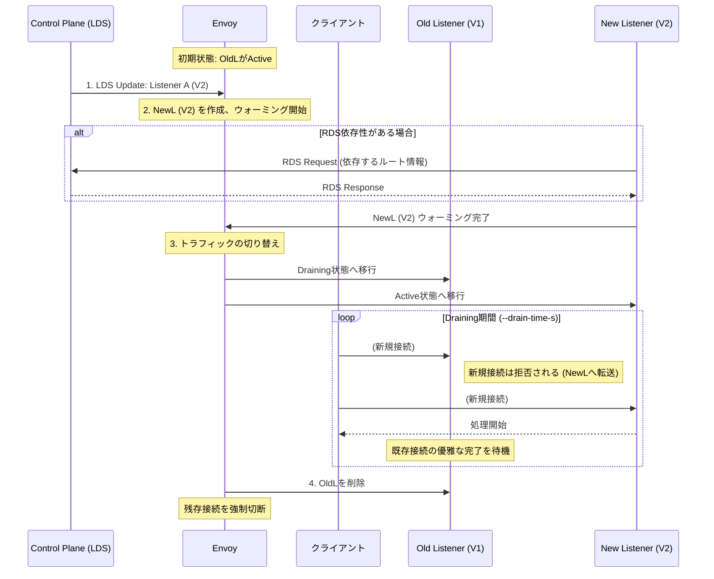

# Listener Discovery Service (LDS)

- [Listener Discovery Service (LDS)](#listener-discovery-service-lds)
    - [1. リスナー更新のセマンティクス（動作規則）](#1-リスナー更新のセマンティクス動作規則)
      - [1. リスナーの識別と命名](#1-リスナーの識別と命名)
      - [2. リスナーの追加とウォーミング (Warming)](#2-リスナーの追加とウォーミング-warming)
      - [3. リスナーの更新（変更）](#3-リスナーの更新変更)
      - [4. リスナーの削除とドレイニング (Draining)](#4-リスナーの削除とドレイニング-draining)
      - [5. フィルターチェーンの部分更新](#5-フィルターチェーンの部分更新)
    - [2. LDSによるリスナーの動的更新シーケンス図](#2-ldsによるリスナーの動的更新シーケンス図)
    - [3. 設定と統計情報](#3-設定と統計情報)

**Listener Discovery Service (LDS)** は、Envoyが**リスナー**（接続を受け付けるポートや設定）を動的に取得・更新するための**オプションのxDS API**です。LDSを利用することで、Envoyを再起動することなく、トラフィックを受け入れる設定をリアルタイムで変更できます。

Envoyは、LDSのAPI応答に基づいて、既知のリスナーを**追加**、**変更**、または**削除**します。

### 1. リスナー更新のセマンティクス（動作規則）

LDSを介したリスナーのライフサイクルは、Envoyの安定した運用を保証するために、厳密な手順に従います。

#### 1. リスナーの識別と命名

* すべてのリスナーは**一意な名前**を持つ必要があります。
* 動的に更新されるリスナーは、管理サーバーによって一意な名前が提供される必要があります（未提供の場合はEnvoyがUUIDを生成）。

#### 2. リスナーの追加とウォーミング (Warming)

新しいリスナーが追加された場合、直ちにトラフィックを受け付けるのではなく、**ウォーミングアップ**という準備プロセスに入ります。

* **ウォーミング**: リスナーが**RDS**などの他の設定を参照している場合、その依存する設定（ルート情報など）が完全に解決され、フェッチされるまで待機します。
* **「Active」への移行**: ウォーミングが完了した後、初めてリスナーは**「Active (アクティブ)」**状態に移行し、トラフィックを受け付け始めます。

#### 3. リスナーの更新（変更）

リスナーは作成後、**実質的に不変**です。そのため、設定が変更された場合でも、既存のリスナーを直接変更するのではなく、**新しいリスナーが作成されます**。

* **新しいリスナーの作成**: 変更された設定を持つ**完全に新しいリスナー**が作成されます。
* **アドレスが同じ場合**: リスナーのアドレス（IP:Port）が変わらない場合、新しいリスナーは**同じ待ち受けソケット**を再利用します。
* **ウォーミング再実行**: 新しいリスナーは、新規追加時と同様のウォーミングプロセスを経ます。
* **アクティブ化**: 新しいリスナーがウォーミングを完了すると、トラフィックの受け付けを開始します。

#### 4. リスナーの削除とドレイニング (Draining)

リスナーが削除される場合、または古いリスナーが新しいものに置き換えられる場合、古いリスナーは **「Draining (ドレイニング)」** 状態に入ります。

* **優雅なクローズ**: サーバー全体のリスタート時と同様に、リスナーが所有する既存の接続は、`--drain-time-s` オプションで設定された期間、**優雅に（gracefully）** 完了するように促されます。
* **完全な削除**: ドレイニング時間が経過した後、リスナーは削除され、残っている接続は強制的にクローズされます。

#### 5. フィルターチェーンの部分更新

TCPリスナーの場合、新しいリスナーが古いリスナーの**フィルターチェーンのサブセット**のみを含んでいる場合、**重複するフィルターチェーン**が所有する既存の接続は開いたまま維持されます。削除されたフィルターチェーンが持つ接続のみがドレイニングされます。

ただし、**グローバルなリスナー属性**が変更された場合、そのリスナー全体（および全てのフィルターチェーン）が削除時と同様にドレインされます。

### 2. LDSによるリスナーの動的更新シーケンス図

LDSを介してリスナー設定が更新され、**ウォーミング**と**ドレイニング**を経て新旧のリスナーが切り替わるフローを示します。

### 3. 設定と統計情報

* **APIリファレンス**: LDSは、gRPCストリーミングエンドポイントを使用する標準的なxDSプロトコルの一部です。
* **統計情報**: LDS関連のメトリクスは、`listener_manager.lds.` のネームスペースに集計されます。これにより、設定の更新頻度や成功/失敗などを監視できます。
