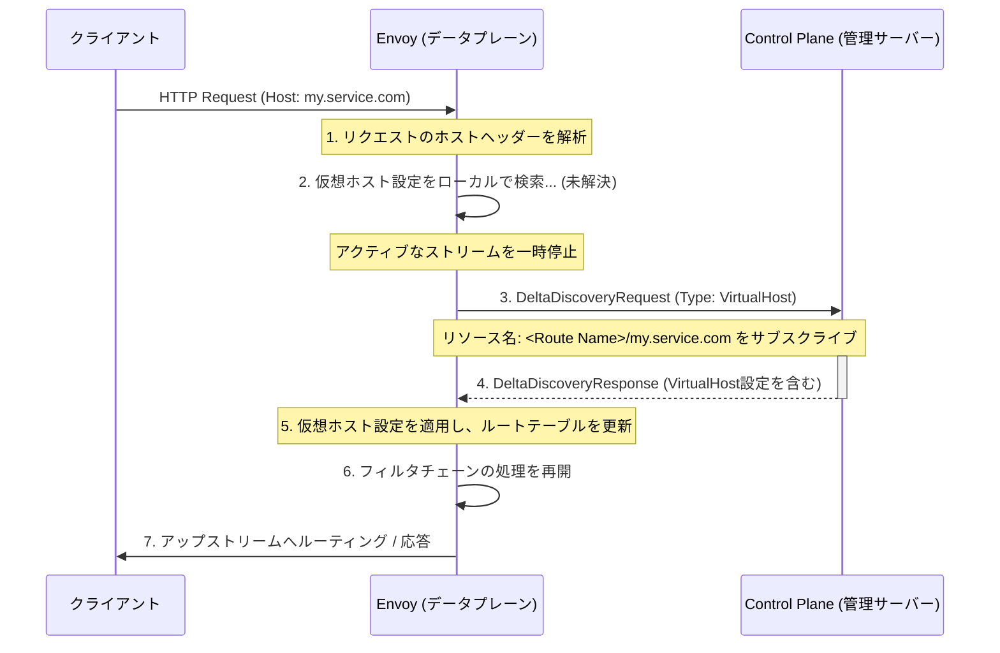

# irtual Host Discovery Service (VHDS)

- [irtual Host Discovery Service (VHDS)](#irtual-host-discovery-service-vhds)
  - [1. VHDS導入の背景にあるスケーリング問題](#1-vhds導入の背景にあるスケーリング問題)
  - [2. VHDSの動作原理：差分サブスクリプション](#2-vhdsの動作原理差分サブスクリプション)
  - [3. VHDSによる仮想ホストの取得シーケンス](#3-vhdsによる仮想ホストの取得シーケンス)
  - [4. 仮想ホストのリソース命名規則](#4-仮想ホストのリソース命名規則)
  - [5. VHDS統計情報](#5-vhds統計情報)
  - [補足：Scoped RDSとの互換性](#補足scoped-rdsとの互換性)

**Virtual Host Discovery Service (VHDS)** は、Envoyが**仮想ホスト（Virtual Host）の設定を動的に取得するためのオプションのxDS API**です。これは、従来のRDS (Route Discovery Service) が抱えていたスケーリングの問題を解決するために導入されました。

## 1. VHDS導入の背景にあるスケーリング問題

従来のRDSでは、メッシュ内の**全てのEnvoyインスタンス**に対して、特定のクラスター（サービス）の**全てのルート**（仮想ホストを含む）が送信されていました。

* **問題点**: 仮想ホストの設定は複雑でサイズが大きくなりがちです。クラスターが大きくなるにつれて、個々のプロキシ（Envoy）が必要としない大量の設定データが配信され、スケーリング上のボトルネックとなっていました。

## 2. VHDSの動作原理：差分サブスクリプション

VHDSは、**Delta xDSプロトコル**を利用することで、この問題を解決します。Envoyは、トラフィックのホストヘッダーに基づいて**必要な仮想ホストのみ**を管理サーバー（Control Plane）に**オンデマンド**でリクエストし、サブスクライブします。

これにより、管理サーバーは、Envoyインスタンスごとにサブスクライブされた仮想ホストのみをフィルタリングして送信します。

| プロトコル | 対象 | 配信方法 | データ量 |
| :--- | :--- | :--- | :--- |
| **従来のRDS** | 全ての仮想ホスト | 全量/差分 (Envoyインスタンス全体) | 大 (不要な設定を含む) |
| **VHDS** | **特定の仮想ホスト** | **Delta xDSによるオンデマンド** | 小 (必要な設定のみ) |

## 3. VHDSによる仮想ホストの取得シーケンス

Envoyがトラフィックを受信し、必要な仮想ホストの設定がローカルに存在しない場合のオンデマンド取得フローを示します。

## 4. 仮想ホストのリソース命名規則

VHDSでサブスクライブされる仮想ホストは、以下の命名規則で識別されます。

$$
\text{<Route Configuration Name>}/\text{<Host Entry>}
$$

* **例**: ルート設定名が `my_routes`、ホストヘッダーが `service.example.com` の場合、リソース名は `my_routes/service.example.com` となります。
* **注意**: スラッシュ（`/`）が含まれるのはルート設定名の方であるため、ホストエントリから逆順（右から左）でマッチングを行う必要があります。

## 5. VHDS統計情報

VHDSの統計情報は、`http.<stat_prefix>.vhds.<virtual_host_name>.` の名前空間にルートを持ちます。これにより、設定のリロード回数や空の更新回数などを監視できます。

* `config_reload`: APIフェッチの結果、設定がリロードされた総回数。
* `empty_update`: 受信した空の更新（実質的な変更なし）の総回数。

## 補足：Scoped RDSとの互換性

VHDSは、**Scoped RDS**（Routing Scopeごとにルート設定を分割する機能）と互換性があります。ただし、Scoped RDSとVHDSを**オンデマンドで両方**使用する場合、1つのルーティングスコープに対して**2回のオンデマンドサブスクリプション**（Scoped RDS用とVHDS用）が必要になります。
