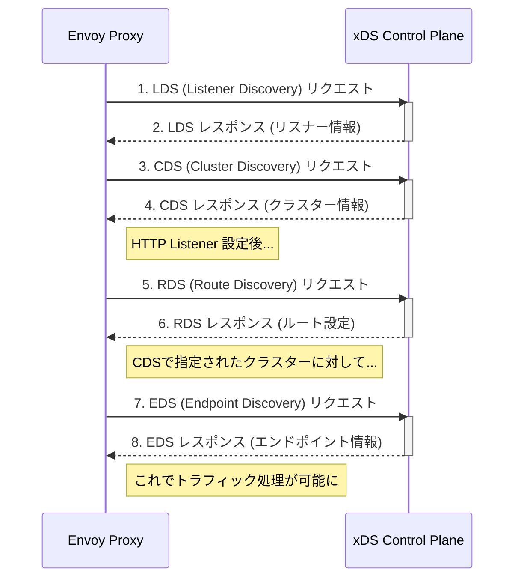

# xDS Configuration API

- [xDS Configuration API](#xds-configuration-api)
  - [Envoy xDS設定API概要](#envoy-xds設定api概要)
    - [主な設定アプローチ](#主な設定アプローチ)
      - [1. 完全静的設定 (Fully static)](#1-完全静的設定-fully-static)
      - [2. 動的設定 (xDS)](#2-動的設定-xds)
    - [xDS APIエンドポイント詳細](#xds-apiエンドポイント詳細)
    - [xDSの連携と応用](#xdsの連携と応用)
      - [Aggregated xDS (**ADS**)](#aggregated-xds-ads)
      - [Delta gRPC xDS](#delta-grpc-xds)
    - [xDS 設定フローのシーケンス図](#xds-設定フローのシーケンス図)
    - [イメージ図](#イメージ図)

## Envoy xDS設定API概要

Envoyは、柔軟な設定管理アプローチが可能になるように設計されています。展開の複雑さに応じて、**静的設定**から**動的設定**へと段階的に移行できます。動的設定を可能にするのが、外部のgRPC/RESTベースのコンフィギュレーション・プロバイダAPI群、総称して **xDS**（\* **discovery service**）です。

### 主な設定アプローチ

#### 1. 完全静的設定 (Fully static)

* **概要**: 設定ファイルで**リスナー**、**クラスター**などを完全に静的に定義します。
* **ホストディスカバリ**: DNSベースのみ可能です。
* **設定更新**: 組み込みの**ホットリスタート**機構を通じてのみ可能です。
* **利点**: シンプルなデプロイに適しています。

#### 2. 動的設定 (xDS)

xDS APIは、Envoyに実行時（ランタイム）に設定を動的にディスカバリさせるためのメカニズムを提供します。

### xDS APIエンドポイント詳細

| API | 名称 | 概要 | 役割の例 |
| :--- | :--- | :--- | :--- |
| **LDS** | Listener Discovery Service | **リスナー**全体（フィルター・スタックを含む）を動的にディスカバリします。 | 新しいポートでの受付開始や、TLS設定の変更。 |
| **RDS** | Route Discovery Service | HTTP接続マネージャーの**ルート設定**全体を実行時にディスカバリします。 | トラフィック・シフティング（A/Bテスト）、ブルー/グリーン・デプロイメント。 |
| **VHDS** | Virtual Host Discovery Service | ルート設定内の**バーチャルホスト**を必要に応じて個別にディスカバリします。 | 非常に多くのバーチャルホストを持つデプロイメントの最適化。 |
| **SRDS** | Scoped Route Discovery Service | ルートテーブルを複数のスコープに分割してディスカバリします。 | 巨大なルートテーブルを持つHTTPルーティングの検索効率化。 |
| **CDS** | Cluster Discovery Service | アップストリームの**クラスター**（接続先サービスの論理グループ）をディスカバリします。 | 新しいアップストリーム・サービスを追加・更新・削除。 |
| **EDS** | Endpoint Discovery Service | クラスター内の**エンドポイント**（具体的なホスト/IPアドレス）をディスカバリします。 | DNSの制限を回避し、カナリア・ステータスやゾーン情報などを利用した高度な負荷分散。 |
| **SDS** | Secret Discovery Service | 暗号化**シークレット**（証明書、秘密鍵、TLSセッションチケット鍵など）をディスカバリします。 | 証明書のローテーション。 |
| **RTDS** | RunTime Discovery Service | **ランタイム・レイヤー**（設定値の上書きなど）をxDS API経由で取得します。 | ファイルシステム層の代わりに、または補完として使用。 |
| **ECDS** | Extension Config Discovery Service | **拡張機能の設定**（例: HTTPフィルター設定）をリスナーとは独立して提供します。 | WAFや障害テストなどのシステム連携。 |

### xDSの連携と応用

#### Aggregated xDS (**ADS**)

* 複数のxDSサービス（EDS, CDSなど）を**単一のgRPCストリーム**で配信する方式。
* リソースがEnvoyに到達する**順序を強制**したい場合に有効です。

#### Delta gRPC xDS

* 標準のxDSが「**State-of-the-World (SotW)**」であり、更新のたびに全てのリソースを含む必要があるのに対し、Delta xDSは**追加/変更/削除されたリソースのみ**を送信します。
* 大規模な設定において、帯域幅と処理の効率を向上させます。

### xDS 設定フローのシーケンス図

Envoyが起動し、LDS、CDS、RDS、EDSを順次ディスカバリしていく一般的なフローをMermaidで示します。

### イメージ図

xDSプロトコルを用いたEnvoyとControl Planeの構成の概念図です。
