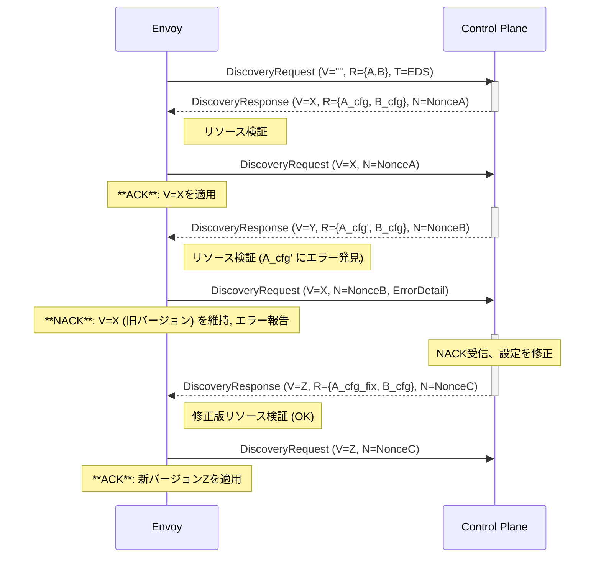

# xDS RESTおよびgRPCプロトコル

- [xDS RESTおよびgRPCプロトコル](#xds-restおよびgrpcプロトコル)
  - [Envoy xDSプロトコル詳細：動的設定の取得と検証](#envoy-xdsプロトコル詳細動的設定の取得と検証)
  - [xDSリソース・タイプとバージョン管理](#xdsリソースタイプとバージョン管理)
    - [PGVによる設定検証](#pgvによる設定検証)
  - [サブスクリプションの種類](#サブスクリプションの種類)
    - [1. ファイルシステム・サブスクリプション](#1-ファイルシステムサブスクリプション)
    - [2. ストリーミング gRPC サブスクリプション](#2-ストリーミング-grpc-サブスクリプション)
      - [API依存性ツリー](#api依存性ツリー)
      - [xDSトランスポート・プロトコルの4つのバリアント](#xdsトランスポートプロトコルの4つのバリアント)
  - [ACK/NACKプロトコルと一貫性の維持](#acknackプロトコルと一貫性の維持)
    - [基本的なメッセージ交換](#基本的なメッセージ交換)
    - [ACK/NACK フローのシーケンス図](#acknack-フローのシーケンス図)
    - [ACK/NACKのセマンティクス](#acknackのセマンティクス)

## Envoy xDSプロトコル詳細：動的設定の取得と検証

Envoyは、動的な設定リソース（**xDS**）を、**ファイルシステム**または1つ以上の**管理サーバー (Control Plane)** から取得します。最も高度なサブスクリプション方法が **ストリーミングgRPC** であり、本稿ではそのプロトコル詳細と、設定の整合性を保つための**ACK/NACK**メカニズムに焦点を当てます。

## xDSリソース・タイプとバージョン管理

xDS APIの各設定リソースは、`envoy.config.<...>.v3.<リソース名>` の形式で識別される**リソース・タイプ**を持ちます。リソースの型は、トランスポートとは独立してバージョン管理されます。

| API (略称) | リソース名 (v3) | 役割 |
| :--- | :--- | :--- |
| **LDS** | `Listener` | リスナー設定 |
| **RDS** | `RouteConfiguration` | ルート設定 |
| **CDS** | `Cluster` | アップストリームクラスター設定 |
| **EDS** | `ClusterLoadAssignment` | クラスターのエンドポイント情報 |
| **SDS** | `Secret` | 暗号化シークレット (TLS証明書など) |
| **RTDS** | `Runtime` | ランタイム設定の上書き |

リソースは、`type.googleapis.com/<リソースタイプ>` という形式の**Type URL**によって一意に識別されます。

### PGVによる設定検証

プロトコルメッセージには **Protoc-Gen-Validate (PGV)** のアノテーションが含まれており、クライアント（Envoy）はこれを用いて受信したリソースの**意味的な制約**（例：ポート番号の範囲など）を検証できます。

## サブスクリプションの種類

### 1. ファイルシステム・サブスクリプション

最もシンプルな方法です。

* **動作**: `inotify` (Linux) や `kqueue` (macOS) を使って設定ファイルを監視し、変更があれば `DiscoveryResponse` protoをパースします。
* **制限**: 設定に問題があっても、**ACK/NACK**によるサーバーへのフィードバック機構がなく、前回の有効な設定が維持されます。

### 2. ストリーミング gRPC サブスクリプション

双方向gRPCストリームを使用し、動的設定をリアルタイムで取得・更新します。

#### API依存性ツリー

Envoyは設定を取得する際、**依存関係ツリー**に従います。

$$
\mathbf{Listener\ (LDS)} \to \mathbf{RouteConfiguration\ (RDS)} \to \mathbf{Cluster\ (CDS)} \to \mathbf{ClusterLoadAssignment\ (EDS)}
$$

Envoyは起動時にルートとなる **LDS** および **CDS** リソースを要求し、それらが参照する **RDS** や **EDS** リソースを順次フェッチします。

#### xDSトランスポート・プロトコルの4つのバリアント

以下の2軸の組み合わせで4種類が存在します。

1. **SotW (State of the World) vs. Incremental (増分)**
   * **SotW**: 要求・応答のたびに**全て**のサブスクライブリソース名/リソース実体を送受信します。スケーラビリティに限界があります。
   * **Incremental**: 要求・応答で**差分 (Delta)** のみ送受信し、スケーラビリティを向上させます。
2.  **分離ストリーム vs. 集約ストリーム (ADS)**
    * **分離ストリーム**: リソースタイプごとに**独立したgRPCストリーム**を使用します (LDSストリーム、CDSストリームなど)。
    * **ADS (Aggregated Discovery Service)**: **単一のgRPCストリーム**で全てのタイプのリソースを多重化し、リソース間の**厳密な順序制御**を可能にします。

| バリアント | SotW/Incremental | ストリーム形態 | RPCサービス |
| :--- | :--- | :--- | :--- |
| **Basic xDS** | SotW | 分離ストリーム | `ListenerDiscoveryService.StreamListeners` など |
| **Incremental xDS** | Incremental | 分離ストリーム | `ListenerDiscoveryService.DeltaListeners` など |
| **ADS** | SotW | 集約ストリーム | `AggregatedDiscoveryService.StreamAggregatedResources` |
| **Incremental ADS** | Incremental | 集約ストリーム | `AggregatedDiscoveryService.DeltaAggregatedResources` |

## ACK/NACKプロトコルと一貫性の維持

gRPCストリーミングの核心は、**ノンス**と**バージョン情報**を用いた信頼性の高い設定適用メカニズム（ACK/NACK）です。

### 基本的なメッセージ交換

| メッセージ | 送信者 | 主な内容 |
| :--- | :--- | :--- |
| `DiscoveryRequest` | Envoy (クライアント) | サブスクリプションリソース名、Type URL、Node ID、**最新の有効バージョン** (`version_info`) |
| `DiscoveryResponse` | Control Plane (サーバー) | リソース実体、**新しいバージョン** (`version_info`)、**ノンス** (`nonce`) |

### ACK/NACK フローのシーケンス図

Envoyは、サーバーから `DiscoveryResponse` を受け取るたびに、その応答と一対一に対応する `DiscoveryRequest` を**すぐに**返送し、設定の適用結果を伝えます。

### ACK/NACKのセマンティクス

* **ACK (承認)**:
  * 応答内の**個々の**リソースが単独で有効であると判断されたことを示します。
  * `version_info` フィールドに**サーバーが送信した新しいバージョン**（例: XやZ）を含めます。
* **NACK (拒否)**:
  * 応答内の**少なくとも1つ**のリソースが無効であったことを示します。
  * `error_detail` フィールドにエラーの詳細を記述します。
  * `version_info` フィールドには、**クライアントが現在適用している（直近で有効であった）古いバージョン**（例: X）を含めます。

これにより、管理サーバーはクライアントがどのバージョンの設定を適用しているかを正確に把握し、設定ミスの原因を追跡することができます。
