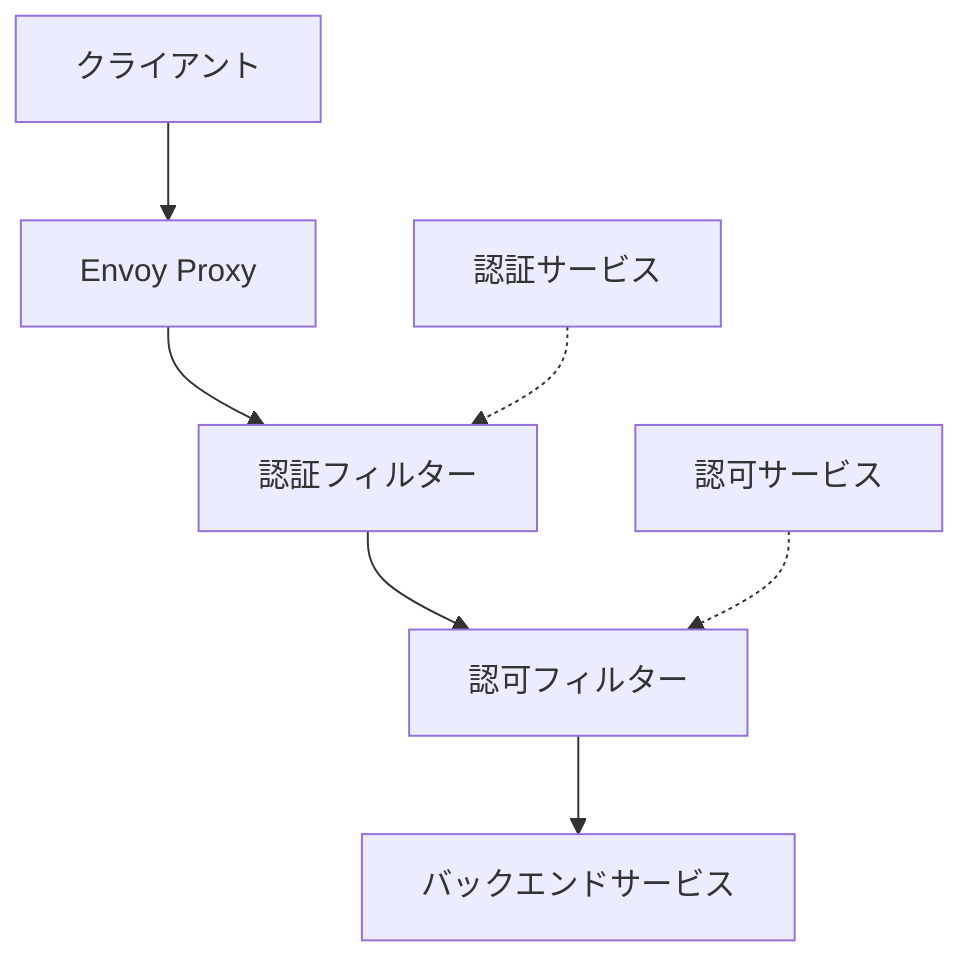

# Envoy における認証・認可

- [Envoy における認証・認可](#envoy-における認証認可)
  - [Envoyにおける認証・認可の概要](#envoyにおける認証認可の概要)
  - [主要な認証メカニズム](#主要な認証メカニズム)
    - [JWT認証](#jwt認証)
      - [主な特徴](#主な特徴)
      - [設定例](#設定例)
      - [最新のトレンド](#最新のトレンド)
    - [OAuth2/OIDC連携](#oauth2oidc連携)
      - [主な特徴](#主な特徴-1)
      - [実装アプローチ](#実装アプローチ)
      - [最新のトレンド](#最新のトレンド-1)
    - [相互TLS認証（mTLS）](#相互tls認証mtls)
      - [主な特徴](#主な特徴-2)
      - [設定例](#設定例-1)
      - [最新のトレンド](#最新のトレンド-2)
    - [外部認証サービス（ext\_authz）](#外部認証サービスext_authz)
      - [主な特徴](#主な特徴-3)
      - [設定例](#設定例-2)
      - [最新のトレンド](#最新のトレンド-3)
  - [主要な認可メカニズム](#主要な認可メカニズム)
    - [ロールベースアクセス制御（RBAC）](#ロールベースアクセス制御rbac)
      - [主な特徴](#主な特徴-4)
      - [設定例](#設定例-3)
      - [最新のトレンド](#最新のトレンド-4)
    - [属性ベースアクセス制御（ABAC）](#属性ベースアクセス制御abac)
      - [主な特徴](#主な特徴-5)
      - [実装アプローチ](#実装アプローチ-1)
      - [最新のトレンド](#最新のトレンド-5)
  - [最新のトレンドと今後の展望](#最新のトレンドと今後の展望)
    - [ゼロトラストアーキテクチャ](#ゼロトラストアーキテクチャ)
      - [Envoyとゼロトラスト](#envoyとゼロトラスト)
      - [最新のトレンド](#最新のトレンド-6)
    - [サービスメッシュにおける認証認可](#サービスメッシュにおける認証認可)
      - [主要なサービスメッシュとEnvoy](#主要なサービスメッシュとenvoy)
      - [最新のトレンド](#最新のトレンド-7)
    - [WebAssembly（WASM）を使用したカスタム認証](#webassemblywasmを使用したカスタム認証)
      - [主な特徴](#主な特徴-6)
      - [実装例](#実装例)
      - [最新のトレンド](#最新のトレンド-8)
  - [ユースケースと実装例](#ユースケースと実装例)
    - [マイクロサービスの保護](#マイクロサービスの保護)
      - [実装例](#実装例-1)
      - [最新のトレンド](#最新のトレンド-9)
    - [APIゲートウェイとしての利用](#apiゲートウェイとしての利用)
      - [実装例](#実装例-2)
      - [最新のトレンド](#最新のトレンド-10)
    - [レガシーシステムの保護](#レガシーシステムの保護)
      - [実装例](#実装例-3)
      - [最新のトレンド](#最新のトレンド-11)
  - [ベストプラクティス](#ベストプラクティス)
    - [セキュリティの階層化](#セキュリティの階層化)
      - [実装例](#実装例-4)
      - [最新のトレンド](#最新のトレンド-12)
    - [認証情報の伝播](#認証情報の伝播)
      - [実装アプローチ](#実装アプローチ-2)
      - [設定例](#設定例-4)
      - [最新のトレンド](#最新のトレンド-13)
    - [監査とロギング](#監査とロギング)
      - [実装アプローチ](#実装アプローチ-3)
      - [設定例](#設定例-5)
      - [最新のトレンド](#最新のトレンド-14)
  - [まとめ](#まとめ)

このドキュメントでは、Envoyプロキシを使用した認証・認可の実装方法、最新のトレンド、ベストプラクティスについて解説します。認証認可をメインに仕事をしているエンジニア向けに、Envoyを活用したセキュリティ強化の方法を詳細に説明します。

## Envoyにおける認証・認可の概要

Envoyは、モダンなサービスメッシュやAPIゲートウェイのコアコンポーネントとして、強力な認証・認可機能を提供します。Envoyの認証・認可は、主に以下の特徴を持っています：

1. **プロキシレベルでの実装**: アプリケーションコードを変更せずに、ネットワークレベルでセキュリティを強化できます。
2. **プラグイン可能なアーキテクチャ**: 様々な認証・認可メカニズムをプラグインとして追加できます。
3. **高性能**: C++で実装されており、高いパフォーマンスを維持しながらセキュリティチェックを実行できます。
4. **動的設定**: xDS APIを通じて、実行時に認証・認可ポリシーを更新できます。

Envoyの認証・認可は、主に以下のコンポーネントで構成されています：



## 主要な認証メカニズム

### JWT認証

JSON Web Token（JWT）は、クレームを安全に転送するためのコンパクトで自己完結型の方法を提供します。Envoyは、`envoy.filters.http.jwt_authn`フィルターを通じてJWT認証をサポートしています。

#### 主な特徴

- 複数のJWTプロバイダーのサポート
- JWKSを使用した署名検証
- クレームベースのルーティング
- トークンの有効期限チェック

#### 設定例

```yaml
http_filters:
- name: envoy.filters.http.jwt_authn
  typed_config:
    "@type": type.googleapis.com/envoy.extensions.filters.http.jwt_authn.v3.JwtAuthentication
    providers:
      provider1:
        issuer: https://auth.example.com
        audiences:
        - api.example.com
        remote_jwks:
          http_uri:
            uri: https://auth.example.com/.well-known/jwks.json
            cluster: jwt_provider
            timeout: 5s
          cache_duration:
            seconds: 300
    rules:
    - match:
        prefix: /api/
      requires:
        provider_name: provider1
```

#### 最新のトレンド

- **JWTプロファイル**: OAuth 2.0認証サーバーフレームワーク（RFC 6749）とOpenID Connect（OIDC）に準拠したJWTプロファイルの採用が増加しています。
- **クレームベースのアクセス制御**: JWTクレームを使用して、きめ細かいアクセス制御を実装する傾向があります。
- **トークンバインディング**: トークンをクライアントの特定の属性（例：TLSセッション）にバインドして、トークン盗難攻撃を防止する手法が注目されています。

### OAuth2/OIDC連携

OAuth2とOpenID Connect（OIDC）は、モダンな認証・認可のスタンダードです。Envoyは、外部認証サービスと連携して、OAuth2/OIDCフローをサポートできます。

#### 主な特徴

- 認証コードフロー
- クライアントクレデンシャルフロー
- リフレッシュトークンの処理
- IDトークンの検証

#### 実装アプローチ

1. **外部認証サービス**: `envoy.filters.http.ext_authz`フィルターを使用して、外部のOAuth2/OIDC認証サービスと連携します。
2. **Luaスクリプト**: `envoy.filters.http.lua`フィルターを使用して、OAuth2/OIDCフローをカスタマイズします。
3. **専用のOAuth2フィルター**: コミュニティが開発した専用のOAuth2フィルターを使用します。

#### 最新のトレンド

- **デバイス認証グラント**: IoTデバイスなど、ブラウザを持たないデバイスのための認証フローの採用が増加しています。
- **PKCE（Proof Key for Code Exchange）**: 認証コードフローのセキュリティを強化するPKCEの採用が標準になっています。
- **DPoP（Demonstration of Proof-of-Possession）**: トークンの盗難を防ぐためのDPoPの採用が増加しています。

### 相互TLS認証（mTLS）

相互TLS認証（mTLS）は、クライアントとサーバーの両方が証明書を使用して互いを認証する方法です。Envoyは、`envoy.transport_sockets.tls`を通じてmTLSをサポートしています。

#### 主な特徴

- クライアント証明書の検証
- 証明書失効リスト（CRL）のサポート
- OCSP（Online Certificate Status Protocol）のサポート
- SNI（Server Name Indication）のサポート

#### 設定例

```yaml
transport_socket:
  name: envoy.transport_sockets.tls
  typed_config:
    "@type": type.googleapis.com/envoy.extensions.transport_sockets.tls.v3.DownstreamTlsContext
    common_tls_context:
      tls_certificates:
      - certificate_chain:
          filename: "/etc/envoy/certs/server.pem"
        private_key:
          filename: "/etc/envoy/certs/server.key"
      validation_context:
        trusted_ca:
          filename: "/etc/envoy/certs/ca.pem"
        require_client_certificate: true
```

#### 最新のトレンド

- **自動証明書管理**: Cert-ManagerやSpiffe/Spireなどのツールを使用した、証明書の自動プロビジョニングと更新が一般的になっています。
- **短命証明書**: セキュリティを強化するために、有効期間の短い証明書（数時間から数日）の使用が増加しています。
- **サービスメッシュでのmTLS**: Istio、Consul、Linkerdなどのサービスメッシュでは、mTLSがデフォルトで有効になる傾向があります。

### 外部認証サービス（ext_authz）

Envoyは、`envoy.filters.http.ext_authz`フィルターを通じて、外部認証サービスと連携できます。これにより、カスタムの認証ロジックを実装できます。

#### 主な特徴

- HTTP/gRPC認証サービスのサポート
- リクエストヘッダー、ボディ、メタデータの送信
- 認証結果に基づくヘッダーの追加/削除
- キャッシュのサポート

#### 設定例

```yaml
http_filters:
- name: envoy.filters.http.ext_authz
  typed_config:
    "@type": type.googleapis.com/envoy.extensions.filters.http.ext_authz.v3.ExtAuthz
    grpc_service:
      envoy_grpc:
        cluster_name: ext_authz_service
      timeout: 0.5s
    failure_mode_allow: false
    with_request_body:
      max_request_bytes: 1024
      allow_partial_message: true
```

#### 最新のトレンド

- **マイクロサービス認証**: 各マイクロサービスが独自の認証要件を持つ場合に、外部認証サービスを使用して一元管理する傾向があります。
- **コンテキストアウェア認証**: ユーザーの行動、デバイス、ロケーションなどのコンテキスト情報を考慮した認証の採用が増加しています。
- **リスクベース認証**: ユーザーのリスクプロファイルに基づいて、認証の厳格さを動的に調整する手法が注目されています。

## 主要な認可メカニズム

### ロールベースアクセス制御（RBAC）

Envoyは、`envoy.filters.http.rbac`フィルターを通じて、ロールベースアクセス制御（RBAC）をサポートしています。これにより、ポリシーに基づいてリクエストを許可または拒否できます。

#### 主な特徴

- プリンシパル（誰が）の定義
- パーミッション（何を）の定義
- ヘッダー、パス、メソッドに基づくマッチング
- ポリシーの階層化

#### 設定例

```yaml
http_filters:
- name: envoy.filters.http.rbac
  typed_config:
    "@type": type.googleapis.com/envoy.extensions.filters.http.rbac.v3.RBAC
    rules:
      action: ALLOW
      policies:
        "admin-policy":
          permissions:
          - and_rules:
              rules:
              - header:
                  name: ":method"
                  string_match:
                    exact: "GET"
              - url_path:
                  path: "/admin"
          principals:
          - authenticated:
              principal_name:
                exact: "admin"
        "user-policy":
          permissions:
          - and_rules:
              rules:
              - header:
                  name: ":method"
                  string_match:
                    exact: "GET"
              - url_path:
                  path: "/user"
          principals:
          - authenticated:
              principal_name:
                exact: "user"
```

#### 最新のトレンド

- **動的RBAC**: xDS APIを使用して、実行時にRBACポリシーを更新する手法が一般的になっています。
- **RBACとOPAの統合**: Open Policy Agent（OPA）などの外部ポリシーエンジンとの統合が増加しています。
- **マイクロセグメンテーション**: サービスメッシュ内のサービス間通信を細かく制御するために、RBACを使用する傾向があります。

### 属性ベースアクセス制御（ABAC）

属性ベースアクセス制御（ABAC）は、ユーザー、リソース、環境の属性に基づいてアクセスを制御する方法です。Envoyでは、外部認証サービスと連携して、ABACを実装できます。

#### 主な特徴

- 複数の属性に基づく決定
- 柔軟なポリシー表現
- コンテキストアウェアな認可

#### 実装アプローチ

1. **外部認可サービス**: `envoy.filters.http.ext_authz`フィルターを使用して、外部のABAC認可サービスと連携します。
2. **CEL（Common Expression Language）**: `envoy.filters.http.rbac`フィルターのCEL拡張を使用して、属性ベースのポリシーを表現します。
3. **OPA（Open Policy Agent）**: OPAと連携して、Regoポリシー言語を使用したABACを実装します。

#### 最新のトレンド

- **ポリシーアズコード**: GitOpsワークフローの一部として、ポリシーをコードとして管理する傾向が増加しています。
- **コンテキストアウェアポリシー**: ユーザーの行動、デバイス、ロケーションなどのコンテキスト情報を考慮したポリシーの採用が増加しています。
- **AIを活用したポリシー決定**: 機械学習モデルを使用して、異常なアクセスパターンを検出し、アクセス決定を支援する手法が研究されています。

## 最新のトレンドと今後の展望

### ゼロトラストアーキテクチャ

ゼロトラストアーキテクチャは、「信頼しない、常に検証する」という原則に基づいています。Envoyは、ゼロトラストアーキテクチャの実装に重要な役割を果たします。

#### Envoyとゼロトラスト

1. **アイデンティティベースのセキュリティ**: サービス間通信において、mTLSを使用してサービスアイデンティティを検証します。
2. **最小権限の原則**: RBACを使用して、必要最小限のアクセス権限を付与します。
3. **継続的な検証**: 各リクエストごとに認証・認可を実行します。
4. **ネットワークセグメンテーション**: マイクロセグメンテーションを実装して、横方向の移動を制限します。

#### 最新のトレンド

- **BeyondCorp/BeyondProd**: Googleが提唱するゼロトラストモデルの採用が増加しています。
- **SPIFFE/SPIRE**: サービスアイデンティティのためのフレームワークとして、SPIFFE/SPIREの採用が増加しています。
- **継続的アクセス評価**: 認証後も継続的にアクセス権を評価し、必要に応じて取り消す手法が注目されています。

### サービスメッシュにおける認証認可

サービスメッシュは、マイクロサービスアーキテクチャにおけるサービス間通信を管理するためのインフラストラクチャレイヤーです。Envoyは、多くのサービスメッシュ実装のデータプレーンとして使用されています。

#### 主要なサービスメッシュとEnvoy

1. **Istio**: Envoyをデータプレーンとして使用し、認証・認可ポリシーを一元管理します。
2. **Consul Connect**: Envoyをデータプレーンとして使用し、サービス間のmTLS通信を実現します。
3. **AWS App Mesh**: Envoyをベースにしたサービスメッシュで、AWSサービスとの統合を提供します。
4. **Kuma/Kong Mesh**: Envoyをデータプレーンとして使用し、マルチクラウド/マルチリージョンのサービスメッシュを実現します。

#### 最新のトレンド

- **マルチクラスタ/マルチメッシュ**: 複数のクラスタやメッシュにまたがるサービス間通信のセキュリティ確保が重要になっています。
- **メッシュ連携**: 異なるサービスメッシュ間の相互運用性と認証連携が注目されています。
- **アンビエントメッシュ**: サイドカーレスのサービスメッシュアーキテクチャが登場し、認証・認可の実装方法に影響を与えています。

### WebAssembly（WASM）を使用したカスタム認証

WebAssembly（WASM）は、Envoyの拡張機能を開発するための新しい方法を提供します。WASMを使用することで、様々な言語でカスタム認証・認可ロジックを実装できます。

#### 主な特徴

- 複数のプログラミング言語のサポート（C++、Rust、AssemblyScript等）
- 動的ロード/アンロード
- サンドボックス化された実行環境
- ホットリロード

#### 実装例

```cpp
// WASMフィルターの例（C++）
#include "proxy_wasm_intrinsics.h"

class AuthFilter : public Context {
public:
  explicit AuthFilter(uint32_t id, RootContext* root) : Context(id, root) {}

  FilterHeadersStatus onRequestHeaders(uint32_t headers, bool end_of_stream) override {
    // カスタム認証ロジック
    auto auth_header = getRequestHeader("Authorization");
    if (!auth_header->has_value() || auth_header->view() != "Bearer valid-token") {
      sendLocalResponse(401, "Unauthorized", "Invalid or missing token", {});
      return FilterHeadersStatus::StopIteration;
    }
    return FilterHeadersStatus::Continue;
  }
};

static RegisterContextFactory register_AuthFilter(CONTEXT_FACTORY(AuthFilter),
                                                 ROOT_FACTORY(RootContext),
                                                 "auth_filter");
```

#### 最新のトレンド

- **言語多様性**: Rust、Go、AssemblyScriptなど、様々な言語でWASMフィルターを開発する傾向が増加しています。
- **フィルターマーケットプレイス**: 再利用可能なWASMフィルターを共有するためのマーケットプレイスの構築が進んでいます。
- **パフォーマンス最適化**: WASMランタイムのパフォーマンス向上と最適化が進んでいます。

## ユースケースと実装例

### マイクロサービスの保護

マイクロサービスアーキテクチャでは、多数のサービスが相互に通信します。Envoyを使用して、これらのサービス間通信を保護できます。

#### 実装例

```yaml
# サービス間通信のmTLS設定
static_resources:
  listeners:
  - name: service_listener
    address:
      socket_address:
        address: 0.0.0.0
        port_value: 8080
    filter_chains:
    - transport_socket:
        name: envoy.transport_sockets.tls
        typed_config:
          "@type": type.googleapis.com/envoy.extensions.transport_sockets.tls.v3.DownstreamTlsContext
          common_tls_context:
            tls_certificates:
            - certificate_chain: { filename: "/etc/envoy/certs/service.pem" }
              private_key: { filename: "/etc/envoy/certs/service.key" }
            validation_context:
              trusted_ca: { filename: "/etc/envoy/certs/ca.pem" }
              require_client_certificate: true
    # ...

  clusters:
  - name: service_b
    connect_timeout: 0.25s
    type: STRICT_DNS
    lb_policy: ROUND_ROBIN
    transport_socket:
      name: envoy.transport_sockets.tls
      typed_config:
        "@type": type.googleapis.com/envoy.extensions.transport_sockets.tls.v3.UpstreamTlsContext
        common_tls_context:
          tls_certificates:
          - certificate_chain: { filename: "/etc/envoy/certs/service.pem" }
            private_key: { filename: "/etc/envoy/certs/service.key" }
          validation_context:
            trusted_ca: { filename: "/etc/envoy/certs/ca.pem" }
    # ...
```

#### 最新のトレンド

- **サービスメッシュの採用**: Istio、Consul、Linkerdなどのサービスメッシュを使用して、マイクロサービスのセキュリティを一元管理する傾向が増加しています。
- **サービスアイデンティティ**: SPIFFE/SPIREなどのフレームワークを使用して、サービスアイデンティティを管理する手法が一般的になっています。
- **ポリシーの一元管理**: サービスメッシュのコントロールプレーンを使用して、認証・認可ポリシーを一元管理する傾向があります。

### APIゲートウェイとしての利用

Envoyは、APIゲートウェイとして使用することで、バックエンドAPIを保護できます。

#### 実装例

```yaml
# APIゲートウェイの設定
static_resources:
  listeners:
  - name: api_gateway
    address:
      socket_address:
        address: 0.0.0.0
        port_value: 8080
    filter_chains:
    - filters:
      - name: envoy.filters.network.http_connection_manager
        typed_config:
          "@type": type.googleapis.com/envoy.extensions.filters.network.http_connection_manager.v3.HttpConnectionManager
          stat_prefix: api_gateway
          route_config:
            name: api_routes
            virtual_hosts:
            - name: api
              domains: ["*"]
              routes:
              - match: { prefix: "/api/v1/" }
                route: { cluster: api_v1 }
              - match: { prefix: "/api/v2/" }
                route: { cluster: api_v2 }
          http_filters:
          - name: envoy.filters.http.jwt_authn
            typed_config:
              "@type": type.googleapis.com/envoy.extensions.filters.http.jwt_authn.v3.JwtAuthentication
              providers:
                auth0:
                  issuer: https://auth.example.com
                  audiences: ["api.example.com"]
                  remote_jwks: { http_uri: { uri: "https://auth.example.com/.well-known/jwks.json", ... } }
              rules:
              - match: { prefix: "/api/" }
                requires: { provider_name: "auth0" }
          - name: envoy.filters.http.rbac
            typed_config:
              "@type": type.googleapis.com/envoy.extensions.filters.http.rbac.v3.RBAC
              rules:
                action: ALLOW
                policies:
                  "api-policy":
                    permissions: [...]
                    principals: [...]
          - name: envoy.filters.http.router
            typed_config:
              "@type": type.googleapis.com/envoy.extensions.filters.http.router.v3.Router
```

#### 最新のトレンド

- **API管理プラットフォームとの統合**: Kong、Tyk、Gloo、Ambassadorなど、EnvoyベースのAPI管理プラットフォームの採用が増加しています。
- **GraphQL対応**: GraphQLクエリの認証・認可を処理するためのフィルターの開発が進んでいます。
- **API製品化**: APIをビジネス製品として提供するための、認証・課金・使用量制限などの機能の統合が進んでいます。

### レガシーシステムの保護

Envoyを使用して、レガシーシステムの前にセキュリティレイヤーを追加できます。

#### 実装例

```yaml
# レガシーシステム保護の設定
static_resources:
  listeners:
  - name: legacy_system_proxy
    address:
      socket_address:
        address: 0.0.0.0
        port_value: 8080
    filter_chains:
    - filters:
      - name: envoy.filters.network.http_connection_manager
        typed_config:
          "@type": type.googleapis.com/envoy.extensions.filters.network.http_connection_manager.v3.HttpConnectionManager
          stat_prefix: legacy_proxy
          route_config:
            name: legacy_routes
            virtual_hosts:
            - name: legacy_app
              domains: ["*"]
              routes:
              - match: { prefix: "/" }
                route: { cluster: legacy_app }
          http_filters:
          - name: envoy.filters.http.ext_authz
            typed_config:
              "@type": type.googleapis.com/envoy.extensions.filters.http.ext_authz.v3.ExtAuthz
              grpc_service:
                envoy_grpc: { cluster_name: auth_service }
                timeout: 0.5s
          - name: envoy.filters.http.lua
            typed_config:
              "@type": type.googleapis.com/envoy.extensions.filters.http.lua.v3.Lua
              inline_code: |
                function envoy_on_request(request_handle)
                  -- レガシーシステム用のヘッダー変換
                  local auth_header = request_handle:headers():get("Authorization")
                  if auth_header ~= nil then
                    local legacy_token = transform_token(auth_header)
                    request_handle:headers():add("X-Legacy-Auth", legacy_token)
                  end
                end

                function transform_token(auth_header)
                  -- トークン変換ロジック
                  return "legacy-" .. auth_header:sub(8)
                end
          - name: envoy.filters.http.router
            typed_config:
              "@type": type.googleapis.com/envoy.extensions.filters.http.router.v3.Router
```

#### 最新のトレンド

- **段階的な近代化**: レガシーシステムを段階的に近代化するために、Envoyを使用してトラフィックを徐々に新しいサービスにシフトする手法が一般的になっています。
- **プロトコル変換**: レガシープロトコルと現代的なプロトコル間の変換を行うフィルターの開発が進んでいます。
- **セキュリティの強化**: 脆弱なレガシーシステムの前にEnvoyを配置して、WAF（Web Application Firewall）機能を提供する手法が増加しています。

## ベストプラクティス

### セキュリティの階層化

単一の防御層に依存するのではなく、複数の防御層を組み合わせることで、セキュリティを強化できます。

#### 実装例

```yaml
# 階層化されたセキュリティの設定
http_filters:
# レイヤー1: レート制限
- name: envoy.filters.http.ratelimit
  typed_config:
    "@type": type.googleapis.com/envoy.extensions.filters.http.ratelimit.v3.RateLimit
    domain: envoy
    rate_limit_service: { ... }

# レイヤー2: JWT認証
- name: envoy.filters.http.jwt_authn
  typed_config:
    "@type": type.googleapis.com/envoy.extensions.filters.http.jwt_authn.v3.JwtAuthentication
    providers: { ... }
    rules: [ ... ]

# レイヤー3: RBAC
- name: envoy.filters.http.rbac
  typed_config:
    "@type": type.googleapis.com/envoy.extensions.filters.http.rbac.v3.RBAC
    rules: { ... }

# レイヤー4: WAF
- name: envoy.filters.http.wasm
  typed_config:
    "@type": type.googleapis.com/envoy.extensions.filters.http.wasm.v3.Wasm
    config:
      name: "modsecurity"
      # ...

# 最終レイヤー: ルーター
- name: envoy.filters.http.router
  typed_config:
    "@type": type.googleapis.com/envoy.extensions.filters.http.router.v3.Router
```

#### 最新のトレンド

- **ゼロトラストアーキテクチャ**: 複数の防御層を組み合わせて、ゼロトラストアーキテクチャを実現する傾向が増加しています。
- **コンテキストアウェアセキュリティ**: リクエストのコンテキスト（ユーザー、デバイス、ロケーション等）に基づいて、適切な防御層を動的に適用する手法が注目されています。
- **自動化されたセキュリティ対応**: セキュリティイベントを検出し、自動的に対応するシステムの採用が増加しています。

### 認証情報の伝播

マイクロサービスアーキテクチャでは、認証情報をサービス間で伝播する必要があります。Envoyは、この伝播を支援するための機能を提供しています。

#### 実装アプローチ

1. **ヘッダーベースの伝播**: JWTやその他の認証情報をHTTPヘッダーとして伝播します。
2. **メタデータベースの伝播**: Envoyのメタデータを使用して、認証情報を伝播します。
3. **サービスアイデンティティ**: mTLSとSPIFFE/SPIREを使用して、サービスアイデンティティを伝播します。

#### 設定例

```yaml
# ヘッダーベースの認証情報伝播
http_filters:
- name: envoy.filters.http.jwt_authn
  typed_config:
    "@type": type.googleapis.com/envoy.extensions.filters.http.jwt_authn.v3.JwtAuthentication
    providers:
      provider1:
        # ...
        from_headers:
        - name: Authorization
          prefix: "Bearer "
        forward: true  # JWTをアップストリームに転送
    # ...

# カスタムヘッダーの追加
- name: envoy.filters.http.lua
  typed_config:
    "@type": type.googleapis.com/envoy.extensions.filters.http.lua.v3.Lua
    inline_code: |
      function envoy_on_request(request_handle)
        local metadata = request_handle:metadata():get("filter_metadata")
        if metadata and metadata["envoy.filters.http.jwt_authn"] then
          local jwt_payload = metadata["envoy.filters.http.jwt_authn"]["jwt_payload"]
          if jwt_payload then
            -- JWTペイロードからユーザーIDを抽出
            local user_id = jwt_payload["sub"]
            if user_id then
              -- カスタムヘッダーとして追加
              request_handle:headers():add("X-User-ID", user_id)
            end
          end
        end
      end
```

#### 最新のトレンド

- **トークン交換**: サービス間通信のために、ユーザートークンをサービストークンに交換する手法が一般的になっています。
- **トークン最小化**: 必要最小限の情報のみを含むトークンを使用して、情報漏洩のリスクを軽減する傾向があります。
- **コンテキスト伝播**: 認証情報だけでなく、トレースID、リクエストID、ユーザーコンテキストなどの情報も伝播する手法が増加しています。

### 監査とロギング

セキュリティイベントの監査とロギングは、セキュリティ体制の重要な部分です。Envoyは、詳細なアクセスログと監査ログを提供します。

#### 実装アプローチ

1. **アクセスログ**: Envoyのアクセスログ機能を使用して、すべてのリクエストをログに記録します。
2. **外部ロギングサービス**: Fluentd、Logstash、Splunkなどの外部ロギングサービスと連携します。
3. **監査フィルター**: カスタムフィルターを使用して、特定のセキュリティイベントを監査します。

#### 設定例

```yaml
# アクセスログの設定
access_log:
- name: envoy.access_loggers.file
  typed_config:
    "@type": type.googleapis.com/envoy.extensions.access_loggers.file.v3.FileAccessLog
    path: "/var/log/envoy/access.log"
    format: |
      [%START_TIME%] "%REQ(:METHOD)% %REQ(X-ENVOY-ORIGINAL-PATH?:PATH)% %PROTOCOL%"
      %RESPONSE_CODE% %RESPONSE_FLAGS% %BYTES_RECEIVED% %BYTES_SENT% %DURATION%
      %RESP(X-ENVOY-UPSTREAM-SERVICE-TIME)% "%REQ(X-FORWARDED-FOR)%" "%REQ(USER-AGENT)%"
      "%REQ(X-REQUEST-ID)%" "%REQ(:AUTHORITY)%" "%UPSTREAM_HOST%" "%DOWNSTREAM_REMOTE_ADDRESS_WITHOUT_PORT%"
      "%REQ(X-USER-ID)%" "%RESP(GRPC-STATUS)%"

# JSON形式のアクセスログ
- name: envoy.access_loggers.file
  typed_config:
    "@type": type.googleapis.com/envoy.extensions.access_loggers.file.v3.FileAccessLog
    path: "/var/log/envoy/access.json"
    json_format:
      start_time: "%START_TIME%"
      method: "%REQ(:METHOD)%"
      path: "%REQ(X-ENVOY-ORIGINAL-PATH?:PATH)%"
      protocol: "%PROTOCOL%"
      response_code: "%RESPONSE_CODE%"
      response_flags: "%RESPONSE_FLAGS%"
      bytes_received: "%BYTES_RECEIVED%"
      bytes_sent: "%BYTES_SENT%"
      duration: "%DURATION%"
      upstream_service_time: "%RESP(X-ENVOY-UPSTREAM-SERVICE-TIME)%"
      x_forwarded_for: "%REQ(X-FORWARDED-FOR)%"
      user_agent: "%REQ(USER-AGENT)%"
      request_id: "%REQ(X-REQUEST-ID)%"
      authority: "%REQ(:AUTHORITY)%"
      upstream_host: "%UPSTREAM_HOST%"
      downstream_remote_address: "%DOWNSTREAM_REMOTE_ADDRESS_WITHOUT_PORT%"
      user_id: "%REQ(X-USER-ID)%"
      grpc_status: "%RESP(GRPC-STATUS)%"
```

#### 最新のトレンド

- **構造化ロギング**: JSON形式などの構造化ログを使用して、ログの解析と検索を容易にする傾向が増加しています。
- **集中ログ管理**: Elasticsearch、Splunk、Google Cloud Loggingなどの集中ログ管理システムとの統合が一般的になっています。
- **リアルタイム分析**: ログをリアルタイムで分析し、セキュリティインシデントを検出する手法が注目されています。
- **AIを活用したログ分析**: 機械学習モデルを使用して、異常なアクセスパターンを検出する手法が研究されています。

## まとめ

Envoyは、モダンなアプリケーションのための強力な認証・認可機能を提供します。JWTやmTLSなどの標準的なメカニズムから、外部認証サービスやWASMを使用したカスタム実装まで、様々なアプローチをサポートしています。

最新のトレンドとしては、ゼロトラストアーキテクチャ、サービスメッシュ、コンテキストアウェアセキュリティなどが注目されています。これらのトレンドは、Envoyの機能と組み合わせることで、より強固なセキュリティ体制を構築するのに役立ちます。

認証認可の専門家として、Envoyの機能を最大限に活用し、セキュリティの階層化、認証情報の適切な伝播、包括的な監査とロギングを実装することで、アプリケーションのセキュリティを強化することができます。
