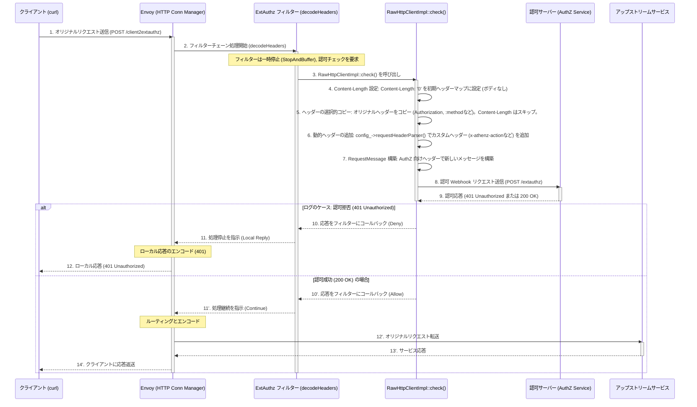

# External Authorization Filter Sequence

```mermaid
sequenceDiagram
    participant C as クライアント (curl)
    participant E as Envoy (HTTP Conn Manager)
    participant F as ExtAuthz フィルター (decodeHeaders)
    participant R as RawHttpClientImpl::check()
    participant A as 認可サーバー (AuthZ Service)
    participant S as アップストリームサービス

    C->>E: 1. オリジナルリクエスト送信 (POST /client2extauthz)
    activate E
    E->>F: 2. フィルターチェーン処理開始 (decodeHeaders)
    activate F
    
    Note over F: フィルターは一時停止 (StopAndBuffer), 認可チェックを要求
    F->>R: 3. RawHttpClientImpl::check() を呼び出し
    activate R
    
    R->>R: 4. Content-Length 設定: Content-Length: '0' を初期ヘッダーマップに設定 (ボディなし)
    
    R->>R: 5. ヘッダーの選択的コピー: オリジナルヘッダーをコピー (Authorization, :methodなど)。Content-Length はスキップ。
    
    R->>R: 6. 動的ヘッダーの追加: config_->requestHeaderParser() でカスタムヘッダー (x-athenz-actionなど) を追加
    
    R->>R: 7. RequestMessage 構築: AuthZ 向けヘッダーで新しいメッセージを構築
    
    R->>A: 8. 認可 Webhook リクエスト送信 (POST /extauthz)
    activate A
    
    A-->>R: 9. 認可応答 (401 Unauthorized または 200 OK)
    deactivate A
    deactivate R
    
    alt ログのケース: 認可拒否 (401 Unauthorized)
        R-->>F: 10. 応答をフィルターにコールバック (Deny)
        F-->>E: 11. 処理停止を指示 (Local Reply)
        Note over E: ローカル応答のエンコード (401)
        E-->>C: 12. ローカル応答 (401 Unauthorized)
    else 認可成功 (200 OK) の場合
        R-->>F: 10'. 応答をフィルターにコールバック (Allow)
        F-->>E: 11'. 処理継続を指示 (Continue)
        Note over E: ルーティングとエンコード
        E->>S: 12'. オリジナルリクエスト転送
        activate S
        S-->>E: 13'. サービス応答
        deactivate S
        E-->>C: 14'. クライアントに応答返送
    end
    
    deactivate F
    deactivate E
```
