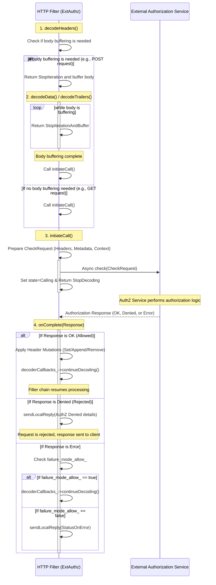

# External Authorization (ExtAuthz) HTTP Filter Implementation

- [External Authorization (ExtAuthz) HTTP Filter Implementation](#external-authorization-extauthz-http-filter-implementation)
  - [Sequence](#sequence)
  - [ExtAuthz Filter Processing Flow](#extauthz-filter-processing-flow)
    - [1. リクエストヘッダーのデコードと処理の停止](#1-リクエストヘッダーのデコードと処理の停止)
      - [`decodeHeaders`関数の一部](#decodeheaders関数の一部)
      - [Description](#description)
    - [2. 外部認証呼び出しの開始](#2-外部認証呼び出しの開始)
      - [`initiateCall`関数の一部](#initiatecall関数の一部)
      - [Description](#description-1)
    - [3. 認証結果の処理](#3-認証結果の処理)
      - [`onComplete`関数の一部](#oncomplete関数の一部)
      - [Description](#description-2)

## Sequence

以下のシーケンス図は、リクエストヘッダーを受け取ってから認証が完了し、処理が継続または拒否されるまでの主要な流れを示しています。



## ExtAuthz Filter Processing Flow

Envoy ExtAuthzフィルターの主要な役割は、リクエストのヘッダーがすべてデコードされた後（または必要なボディデータがバッファリングされた後）に、**外部の認証サービス（AuthZサービス）** を呼び出し、その結果に基づいてリクエストを継続（`OK`）するか、拒否（`Denied`）するかを決定することです。

<details><summary>バッファリング</summary>

- バッファリングとは？
  - 「バッファリング」とは、Envoyがクライアントから受信している**リクエストボディのデータ全体を、一旦フィルター内部のメモリに蓄積する作業**のことです。
  - これは、外部認証サービス（AuthZサービス）が、認証の判断材料として**リクエストのヘッダーだけでなく、ボディの内容も必要としている**場合に発生します。

- ヘッダーのみ必要な場合（多くの場合）:
  - `Filter::decodeHeaders(headers, end_stream)`が呼び出されたときです。
    - リクエストがボディを持たない（例: GET）か、設定でボディをAuthZサービスに送らないようにしている場合、decodeHeadersがリクエストの完全なヘッダーを受け取った時点で認証コールを開始できます。
  - ボディが必要な場合（設定で要求された場合）:
    - `Filter::decodeData(data, end_stream)やFilter::decodeTrailers(trailers)`が呼び出され、リクエストボディのバッファリングが完了した瞬間です。
    - ボディ全体をAuthZサービスに送る設定の場合、FilterはdecodeDataで`**Http::FilterDataStatus::StopIterationAndBuffer**`を返してボディを蓄積します。
    - end_streamがtrueになったとき、またはバッファの最大サイズに達したときに、蓄積されたデータとヘッダーを使ってinitiateCallが実行されます。

| `CheckRequest` に含まれる主な情報 | 取得元 |
| :--- | :--- |
| **Request Headers** | `decodeHeaders`の引数 |
| **Request Body** | `decoder_callbacks_->decodingBuffer()` (バッファリングされたデータ) |
| **Context Extensions** | ルート設定 |
| **Metadata** | `StreamInfo` / `Route` メタデータ |
| **Peer Certificate / TLS Session** | `StreamInfo` |

設定でリクエストボディをExternal Authorization (ExtAuthz) サービスに含めることが要求されるのは、主にEnvoyの**フィルター設定**または**ルートごとの設定**で、`with_request_body`フィールドが構成されている場合です。

具体的には、以下のいずれかの場所で設定されます。

1. グローバルフィルター設定
   1. ExtAuthz HTTPフィルターのトップレベル設定にある`with_request_body`ブロックです。
   2. この設定は、特にルートごとの設定で上書きされない限り、そのフィルターが適用されるすべてのリクエストに適用されます。

</details>

### 1. リクエストヘッダーのデコードと処理の停止

`decodeHeaders`関数がHTTPリクエストのヘッダーを受信したときに、認証が必要かどうかの判断を行います。

#### `decodeHeaders`関数の一部

```c++
Http::FilterHeadersStatus Filter::decodeHeaders(Http::RequestHeaderMap& headers, bool end_stream) {
  // ... (skip check, filter disabled check) ...

  request_headers_ = &headers;
  const auto& check_settings = per_route_flags.check_settings_;
  // バッファリングが必要かどうかの判断ロジック
  buffer_data_ = (config_->withRequestBody() || check_settings.has_with_request_body()) &&
                 !check_settings.disable_request_body_buffering() &&
                 !(end_stream || Http::Utility::isWebSocketUpgradeRequest(headers) ||
                   Http::Utility::isH2UpgradeRequest(headers));

  // ... (max_request_bytesの設定など) ...

  if (buffer_data_) {
    // バッファリングが必要な場合、ここで処理を停止し、後続のボディデータを待つ
    return Http::FilterHeadersStatus::StopIteration;
  }

  // バッファリングが不要な場合、直ちに認証コールを開始
  initiateCall(headers);
  return filter_return_ == FilterReturn::StopDecoding
             ? Http::FilterHeadersStatus::StopAllIterationAndWatermark
             : Http::FilterHeadersStatus::Continue;
}
```

#### Description

1. ルート設定やランタイムフラグに基づいて、認証を**スキップしない**ことを確認します。
2. **リクエストボディのバッファリング**が必要かどうかを判断します。
   - 必要な場合 (`buffer_data_ == true`): **`StopIteration`**を返し、後続の`decodeData`でボディをバッファリングするようにEnvoyに伝えます。
   - 不要な場合: 直ちに`initiateCall`を呼び出し、AuthZサービスへのコールを開始します。
   - AuthZコールが非同期であるため、通常は`StopAllIterationAndWatermark`を返してフィルターチェーン全体の処理を一時停止します。

<details><summary>一時停止する必要性</summary>

- 非同期で外部サービスを呼び出す場合でも、認証の結果を待たずにEnvoyが次のフィルターやアップストリームへの転送に進んでしまうと、未認証のリクエストを許可してしまうことになります。
  - `Http::FilterHeadersStatus::StopAllIterationAndWatermark`（またはStopIteration）は、「認証結果が返ってくるまで、リクエスト（ヘッダー、ボディなど）のデコード処理をこれ以上進めないでください」という指示をEnvoyのフィルターチェーンに与えるために使われます。
  - この停止により、AuthZの結果が OK でない限り、リクエストがルーティングやアップストリームへの接続に進むのを防ぎます。

</details>

### 2. 外部認証呼び出しの開始

`initiateCall`関数で、`CheckRequest`を作成し、AuthZサービスへの非同期呼び出しを行います。

<details><summary>initalCallの引数はheaderのみ？つまりcheckrequestはheaderの情報だけで作られる？</summary>

initiateCallの定義：

```cpp
void Filter::initiateCall(const Http::RequestHeaderMap& headers)
```

の通り、引数自体はヘッダーのみです。しかし、CheckRequestはヘッダーの情報だけで作られるわけではありません。

- CheckRequestの作成は`Filters::Common::ExtAuthz::CheckRequestUtils::createHttpCheck`内で行われ、この関数は以下の情報も利用します。
  - `decoder_callbacks_`から取得できるストリーム情報（接続情報、TLSピア証明書、TLSセッションなど）。
  - `decoder_callbacks_->streamInfo().dynamicMetadata()`から取得できる動的メタデータ。
  - `decoder_callbacks_->route()->metadata()`から取得できるルートメタデータ。
  - `decoder_callbacks_->decodingBuffer()`から取得できるバッファリングされたリクエストボディ。
  - ルート設定やグローバル設定から取得されるコンテキスト拡張。

1. HTTP/gRPCについて: `createHttpCheck`は、AuthZサービスがHTTPサービスであろうとgRPCサービスであろうと、Envoyの内部表現であるCheckRequestプロトコルバッファを作成するために使われます。
   1. gRPCサービスの場合: 作成されたCheckRequestプロトコルバッファがそのまま外部サービスに送信されます。
   2. HTTPサービスの場合: 作成されたCheckRequest（またはその一部）がHTTPリクエストのボディとしてエンコードされ、指定されたURIに送信されます。

</details>

#### `initiateCall`関数の一部

```c++
void Filter::initiateCall(const Http::RequestHeaderMap& headers) {
  if (filter_return_ == FilterReturn::StopDecoding) {
    return;
  }

  // ... (Per-route config/client determination, metadata collection) ...

  Filters::Common::ExtAuthz::CheckRequestUtils::createHttpCheck(
      // ... (headers, context_extensions, metadata_context, etc.) ...
      check_request_, max_request_bytes_, config_->packAsBytes(),
      // ... (other parameters) ...
  );

  ENVOY_STREAM_LOG(trace, "ext_authz filter calling authorization server.", *decoder_callbacks_);
  start_time_ = decoder_callbacks_->dispatcher().timeSource().monotonicTime();

  state_ = State::Calling;
  filter_return_ = FilterReturn::StopDecoding; // フィルターチェーンの継続を停止
  cluster_ = decoder_callbacks_->clusterInfo();
  initiating_call_ = true;
  // 非同期でAuthZサービスを呼び出す
  client_to_use->check(*this, check_request_, decoder_callbacks_->activeSpan(),
                       decoder_callbacks_->streamInfo());
  initiating_call_ = false;
}
```

<details><summary>with_request_body</summary>

1. `with_request_body`の設定は、EnvoyがAuthZサービスへのリクエストに**オリジナルのリクエストボディを含めるかどうか**を制御します。
   1. `with_request_body` を設定した場合 (ボディ転送を要求)
      1. 設定が存在する場合、Envoyはクライアントから受信したリクエストボディをバッファリングし、そのボディをAuthZサービスへのリクエストに含めます。

        | サービス種別 | AuthZリクエストの挙動 |
        | :--- | :--- |
        | **gRPC** | `envoy.service.auth.v3.CheckRequest` Protobufメッセージのフィールド（`http_request.body`）に、**リクエストボディの中身**が格納されて送信されます。 |
        | **HTTP** | AuthZサービス宛ての新しいHTTPリクエストの**ボディ**に、**オリジナルのリクエストボディの中身**が設定されて送信されます。 |

      2. この場合、AuthZサービスはリクエストボディを読み取り、認証・認可の判断材料として利用できます（例：特定のリクエストボディの内容に基づくポリシーチェック）。
2. `with_request_body` を設定しなかった場合 (ボディ転送を要求しない)
   1. 設定が存在しない、または無効になっている場合、EnvoyはリクエストボディをAuthZサービスへのリクエストに含めません。

        | サービス種別 | AuthZリクエストの挙動 |
        | :--- | :--- |
        | **gRPC** | `CheckRequest`メッセージの`http_request.body`フィールドは**空**になります。 |
        | **HTTP** | AuthZサービス宛ての新しいHTTPリクエストの**ボディ**は**空**になるか、最小限のデータ（空のJSON `{}`など）になることがあります。 |

   2. この場合でも、**Envoyに届いたクライアントからのリクエスト自体はボディを持っています**（例：`POST`リクエスト）。
   3. しかし、ExtAuthzフィルターはボディをバッファリングしないため、AuthZサービスが受け取るリクエストにはボディが含まれず、AuthZサービスはヘッダーやメタデータのみに基づいて判断を行います。

| 設定有無 | Envoyでの処理 | AuthZサービスが受け取るボディ |
| :--- | :--- | :--- |
| **設定あり** (`with_request_body`を使用) | ボディをバッファリングし、`CheckRequest`に含める | **存在する** (オリジナルと同じ) |
| **設定なし** | ボディをバッファリングしない | **空** |

</details>

#### Description

<details><summaryリクエストヘッダの取得元</summary>

1. リクエストヘッダーの取得元:
   1. Envoyに届いたクライアントからのHTTPリクエストのヘッダーです。
   2. 具体的には、`Http::FilterHeadersStatus Filter::decodeHeaders(Http::RequestHeaderMap& headers, bool end_stream)`の引数として渡される**headers**オブジェクトを指します。
2. ヘッダーの書き換え:
   1. ExtAuthzフィルターより前に配置された他のHTTPデコーダーフィルター（例: ルーターフィルター、CORSフィルターなど）が、このheadersを既に書き換えている可能性があります。
   2. ExtAuthzフィルターは、その時点での最新のリクエストヘッダーを読み取って認証に使用します。

</details>

1. AuthZサービスに送るためのリクエストオブジェクト（`check_request_`）を、リクエストヘッダーや動的/ルートメタデータなどから作成します。
1. 状態を`State::Calling`に設定し、`filter_return_`を`FilterReturn::StopDecoding`に設定して、**フィルターチェーンの処理を停止**させます。
1. 設定されたクライアント（`client_to_use`）を通じて、**非同期**でAuthZサービス（gRPCまたはHTTP）を呼び出します。

<details><summary>Check Requestの作成と送信</summary>

1. CheckRequestの作成と送信は、AuthZサービスがgRPCかHTTPかによって異なります。
   1. gRPCサービスの場合 (推奨)
      1. リクエストの作成: `CheckRequestUtils::createHttpCheck`により、`envoy.service.auth.v3.CheckRequestと`いうProtobufメッセージが作成されます。
      2. このメッセージには、リクエストのヘッダー、ボディ（バッファリングされている場合）、ピア証明書、コンテキスト拡張などがフィールドとして格納されます。
      3. 送信:
         1. Protobufメッセージはシリアライズされ、EnvoyのgRPCクライアント（GrpcClientImpl）を通じて、設定されたクラスタの宛先に**Check** メソッドとして送信されます。
   2. HTTPサービスの場合
      1. リクエストの作成: AuthZサービス宛ての新しいHTTPリクエストを作成します。
      2. AuthZサービス設定（http_service）で指定されたURI（例: http://authz.service/v1/auth）とHTTPメソッド（例: POST）が使われます。
      3. データ格納:
         1. Envoyが転送を許可するように設定されたクライアントリクエストヘッダーは、AuthZサービス宛てのリクエストヘッダーにコピーされます。
         2. CheckRequestに含めると設定されたリクエストボディ（もしあれば）は、AuthZサービス宛てのリクエストのボディに含められます。
      4. 送信:
         1. EnvoyのHTTPクライアント（RawHttpClientImpl）を通じて、AuthZサービス宛てのHTTPリクエストとして送信されます。

</details>

### 3. 認証結果の処理

非同期呼び出しの結果は、`onComplete`コールバック関数で処理されます。これがリクエスト処理の運命を決定します。

#### `onComplete`関数の一部

```c++
void Filter::onComplete(Filters::Common::ExtAuthz::ResponsePtr&& response) {
  state_ = State::Complete;
  using Filters::Common::ExtAuthz::CheckStatus;

  // ... (Update logging info, dynamic metadata handling) ...

  switch (response->status) {
  case CheckStatus::OK: {
    // 認証成功
    // ... (Clear route cache logic) ...

    // AuthZサービスが指示したヘッダーの変更をリクエストヘッダーに適用
    Http::HeaderUtility::applyHeaderMutations(*request_headers_, response->headers_to_set, 
                                             response->headers_to_append, response->headers_to_remove,
                                             *config_->decoderHeaderMutationChecker());

    // 処理を再開
    decoder_callbacks_->continueDecoding();
    break;
  }
  case CheckStatus::Denied: {
    // 認証拒否
    // ... (Set response flag, Denied stats increment) ...

    // AuthZサービスからのレスポンスに基づいてローカルレスポンスを送信
    decoder_callbacks_->sendLocalReply(
        response->status_code, response->body, response->headers, absl::nullopt, 
        Filters::Common::ExtAuthz::ResponseCodeDetails::get().AuthzDenied);
    break;
  }
  // ... (CheckStatus::Error handling, often using failure_mode_allow_) ...
  }
}
```

#### Description

1. **`CheckStatus::OK` (許可)**:
   * AuthZサービスからの指示に従って、リクエストヘッダーを**変更**（追加、設定、削除）します。
   * `decoder_callbacks_->continueDecoding()`を呼び出し、**一時停止していたフィルターチェーンの処理を再開**します。
2. **`CheckStatus::Denied` (拒否)**:
   * AuthZサービスが指定したステータスコード、ボディ、ヘッダーを使用して、クライアントに**ローカルレスポンスを即座に送信**します (`sendLocalReply`)。リクエストはバックエンドに転送されません。
3. **`CheckStatus::Error` (エラー)**:
   * `failure_mode_allow_`設定に基づき、許可/拒否の判断が行われます。
