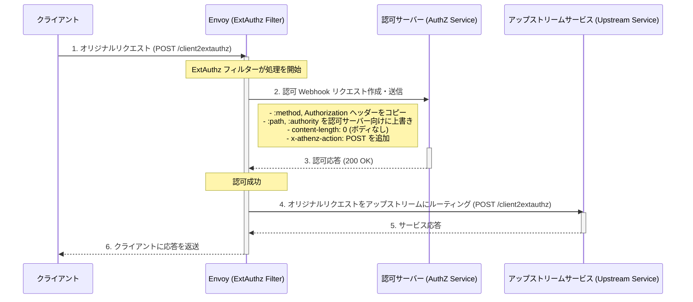
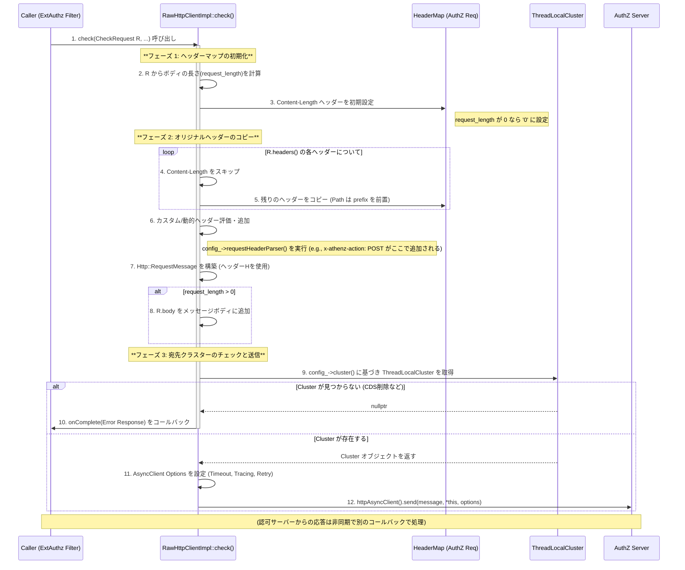

# How to create webhook request

- [How to create webhook request](#how-to-create-webhook-request)
  - [Sequence](#sequence)
  - [void RawHttpClientImpl::check Sequence](#void-rawhttpclientimplcheck-sequence)
  - [Implementation](#implementation)
    - [1. 認可リクエストの構築と送信の起点](#1-認可リクエストの構築と送信の起点)
    - [2. ヘッダーの具体的な操作箇所](#2-ヘッダーの具体的な操作箇所)

## Sequence

## void RawHttpClientImpl::check Sequence

## Implementation

### 1. 認可リクエストの構築と送信の起点

この処理全体を担う主要なクラスは、`ext_authz` フィルターが内部的に利用する HTTP クライアントの実装です。

- **ファイル**: `source/extensions/filters/http/ext_authz/raw_http_client_impl.cc`
- **関数**: `RawHttpClientImpl::check(RequestCallbacks& callbacks, const envoy::service::ext_authz::v3::CheckRequest& request, Tracing::Span& parent_span, const StreamInfo::StreamInfo& stream_info)`

この `check` 関数内で、以下のステップが実行されます。

1. 認可リクエストを作成するために必要なすべての情報（元のリクエストヘッダー、ボディ、`ext_authz` 設定）が渡されます。
1. この関数が、**アップストリーム（認可サーバー）への接続プール**を見つけ、新しいストリームを作成し、リクエストのエンコードと送信をトリガーします。

### 2. ヘッダーの具体的な操作箇所

ヘッダーの具体的な操作は、`check` 関数内で実行されるロジックと、設定ファイルに基づいています。

| 操作内容 | 実装の具体的な処理/設定 | 補足 |
| :--- | :--- | :--- |
| **`:method`, `Authorization` ヘッダーをコピー** | `check` 関数内で、**オリジナルのリクエストヘッダーをループしてコピー**するロジック。 | ここで、`http_request.headers()` のすべての非禁止ヘッダー（`:method` などを含む）が新しい AuthZ リクエストヘッダーマップにコピーされます。 |
| **`:path`, `:authority` を認可サーバー向けに上書き** | `check` 関数内で、`ext_authz` フィルターの設定に基づき、**ターゲットクラスター (`authorization-sidecar`) の設定**から取得した情報を使用して、これらの**擬似ヘッダーを新しい値で上書き**します。 | `:path` は設定されている `/extauthz` に、`:authority` は設定されている `authorizer.athenz.svc.cluster.local` になります。 |
| **`content-length: 0` (ボディなし)** | `ext_authz` 設定で `with_request_body` がないため、`check` 関数内でリクエストボディがないと判断され、ヘッダーに **`content-length: 0`** が追加されます。 |
| **`x-athenz-action: POST` を追加** | `http_service` の設定にある `authorization_request.headers_to_add` の処理。 | 設定されている値 `x-athenz-action: "%REQ(:METHOD)%"` に基づき、このカスタムヘッダーを新しいリクエストヘッダーマップに**追加**します。 |
