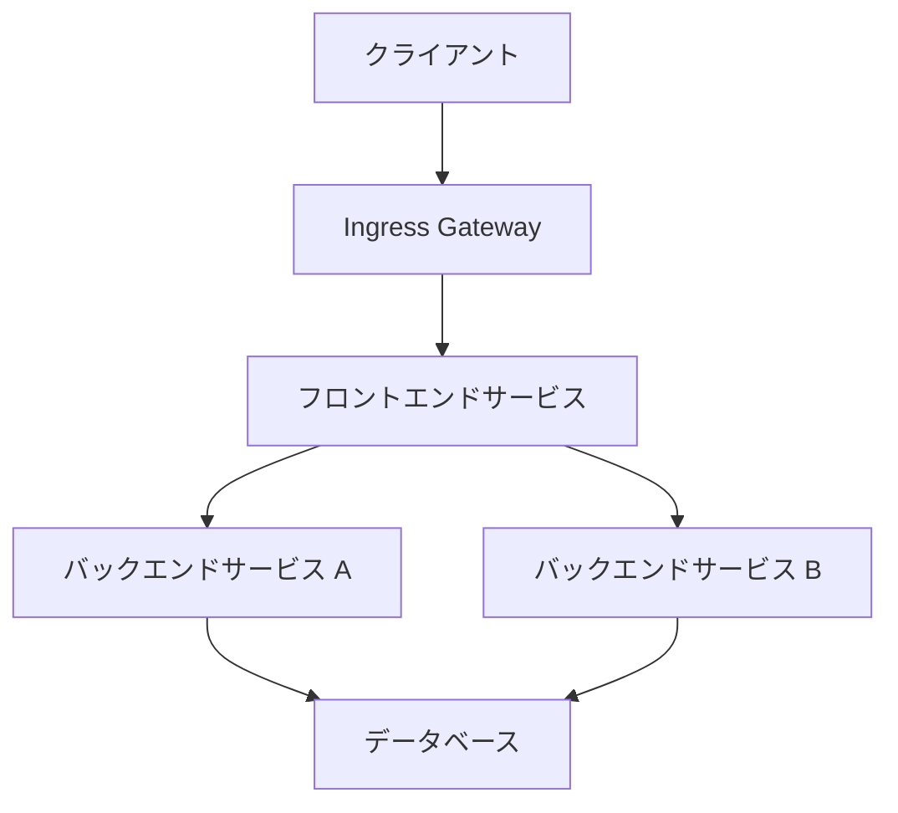

# Envoy Proxy サンプルアプリケーション (Kind)

このディレクトリには、Kubernetes in Docker (Kind) を使用してEnvoy Proxyの機能を実演するサンプルアプリケーションが含まれています。このサンプルでは、Envoyをサービスメッシュとして使用し、マイクロサービス間の通信を制御および監視する方法を示します。

## 前提条件

このサンプルを実行するには、以下のツールが必要です：

- [Docker](https://docs.docker.com/get-docker/)
- [Kind](https://kind.sigs.k8s.io/docs/user/quick-start/#installation)
- [kubectl](https://kubernetes.io/docs/tasks/tools/install-kubectl/)
- [Helm](https://helm.sh/docs/intro/install/) (オプション)

## アーキテクチャ

このサンプルアプリケーションは、以下のコンポーネントで構成されています：



- **Ingress Gateway**: 外部トラフィックをクラスター内のサービスにルーティングするEnvoyプロキシ
- **フロントエンドサービス**: ユーザーインターフェースを提供するウェブアプリケーション
- **バックエンドサービス A**: APIサービス
- **バックエンドサービス B**: 別のAPIサービス
- **データベース**: サンプルデータを格納するデータベース

各サービスは、サイドカーとしてEnvoyプロキシを実行し、サービス間の通信を処理します。

## ディレクトリ構造

```
examples/kind/
├── README.md                     # このファイル
├── setup.sh                      # セットアップスクリプト
├── cleanup.sh                    # クリーンアップスクリプト
├── manifests/                    # Kubernetesマニフェスト
│   ├── namespace.yaml            # 名前空間定義
│   ├── database.yaml             # データベースデプロイメント
│   ├── backend-a.yaml            # バックエンドサービスAのデプロイメント
│   ├── backend-b.yaml            # バックエンドサービスBのデプロイメント
│   ├── frontend.yaml             # フロントエンドのデプロイメント
│   └── ingress.yaml              # Ingressゲートウェイの設定
├── configs/                      # Envoy設定ファイル
│   ├── ingress-envoy.yaml        # Ingressゲートウェイの設定
│   ├── frontend-envoy.yaml       # フロントエンドサービスの設定
│   ├── backend-a-envoy.yaml      # バックエンドサービスAの設定
│   └── backend-b-envoy.yaml      # バックエンドサービスBの設定
└── services/                     # サービスのソースコード
    ├── frontend/                 # フロントエンドサービス
    ├── backend-a/                # バックエンドサービスA
    └── backend-b/                # バックエンドサービスB
```

## セットアップ手順

### 1. Kindクラスターの作成

```bash
# Kindクラスターを作成
kind create cluster --name envoy-demo

# クラスターの状態を確認
kubectl cluster-info --context kind-envoy-demo
```

### 2. サンプルアプリケーションのデプロイ

```bash
# セットアップスクリプトを実行
./setup.sh
```

このスクリプトは以下の操作を行います：

1. 必要な名前空間を作成
2. データベースをデプロイ
3. バックエンドサービスをデプロイ
4. フロントエンドサービスをデプロイ
5. Envoy Ingressゲートウェイをデプロイ

### 3. アプリケーションへのアクセス

セットアップが完了すると、以下のコマンドでIngressゲートウェイのポートを転送できます：

```bash
kubectl port-forward -n envoy-demo svc/ingress-gateway 8080:80
```

ブラウザで http://localhost:8080 にアクセスすると、サンプルアプリケーションが表示されます。

## 機能デモ

このサンプルアプリケーションでは、以下のEnvoyの機能をデモンストレーションしています：

### 1. トラフィックルーティング

フロントエンドからバックエンドサービスへのトラフィックは、パスベースのルーティングを使用しています：

- `/api/service-a/*` → バックエンドサービスA
- `/api/service-b/*` → バックエンドサービスB

### 2. ロードバランシング

バックエンドサービスは複数のレプリカで実行され、Envoyがラウンドロビン方式でトラフィックを分散します。

### 3. サーキットブレーキング

バックエンドサービスへの過剰な接続を防ぐために、サーキットブレーキングが設定されています。

### 4. リトライ

一時的な障害が発生した場合、Envoyは自動的にリクエストを再試行します。

### 5. メトリクス収集

Envoyは、Prometheusと互換性のあるメトリクスを公開しています。以下のコマンドでEnvoyの管理インターフェースにアクセスできます：

```bash
kubectl port-forward -n envoy-demo deploy/frontend 9901:9901
```

ブラウザで http://localhost:9901 にアクセスすると、Envoyの管理インターフェースが表示されます。

### 6. 分散トレーシング

サービス間のリクエストは、Zipkinと互換性のある分散トレーシングシステムで追跡できます。

## クリーンアップ

```bash
# クリーンアップスクリプトを実行
./cleanup.sh

# または、Kindクラスターを削除
kind delete cluster --name envoy-demo
```

## トラブルシューティング

### ポッドの状態確認

```bash
kubectl get pods -n envoy-demo
```

### ログの確認

```bash
# フロントエンドのログを確認
kubectl logs -n envoy-demo deploy/frontend -c app

# フロントエンドのEnvoyプロキシのログを確認
kubectl logs -n envoy-demo deploy/frontend -c envoy
```

### Envoy設定の確認

```bash
# フロントエンドのEnvoy設定をダンプ
kubectl exec -n envoy-demo deploy/frontend -c envoy -- curl localhost:9901/config_dump
```

## 詳細情報

このサンプルアプリケーションの詳細については、以下のドキュメントを参照してください：

- [Envoy アーキテクチャ概要](../../docs/architecture/overview.md)
- [Envoy 設定ガイド](../../docs/usage/configuration.md)
